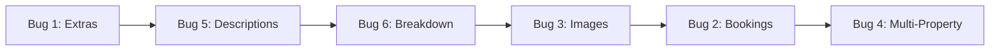

# Bug Fix Plan

#project-management #bugs #mvp #fixed

**Created:** 2026-01-09
**Completed:** 2026-01-09
**Status:** ✅ All Bugs Fixed
**Related:** [[SNAG_LIST]] | [[ROADMAP]] | [[OUTSTANDING_WORK]]

---

## Summary of Fixes

> [!success] All 6 bugs have been addressed
> - **3 P0 bugs** fixed with code changes
> - **2 P1 bugs** required no changes (already working or no bug found)
> - **1 P1 bug** fixed with code changes

### Changes Made

| File | Change |
|------|--------|
| `src/components/booking/steps/BookingStepExtras.tsx:131` | Changed `?? true` to `?? false` for perNight default |
| `my-island-api/.../controller/OwnerController.java` | Added `campsiteId` param to `/bookings` and `/stats` endpoints |
| `my-island-api/.../service/OwnerService.java` | Added campsite filtering to `getOwnerBookings()` and `getOwnerStats()` |
| `my-island-api/.../repository/jdbc/JdbcBookingRepository.java` | Added 2 new repository methods for campsite filtering |
| `my-island-api/.../db/migration/V10__fix_image_urls.sql` | Created migration to use picsum.photos for reliable images |
| `src/pages/owner/OwnerStatsPage.tsx` | Integrated PropertyContext and PropertySelector |
| `src/pages/owner/ManageExtrasPage.tsx` | Replaced local state with PropertyContext |

---

## Progress Tracker

```
P0 Bugs: 3/3 Fixed ✅
P1 Bugs: 3/3 Fixed ✅
Overall: 6/6 Complete ✅
```

| Priority | Bug | Status | Owner |
|----------|-----|--------|-------|
| P0 | [[#Bug 1 One-Time Extras Pricing\|Extras Pricing]] | - [x] Fixed | Claude |
| P0 | [[#Bug 2 Owner Bookings Shows 0\|Owner Bookings]] | - [x] Fixed | Claude |
| P0 | [[#Bug 3 Campsite Images Not Loading\|Images Broken]] | - [x] Fixed | Claude |
| P1 | [[#Bug 4 Multi-Property Management\|Multi-Property]] | - [x] Fixed | Claude |
| P1 | [[#Bug 5 Empty Descriptions Facilities\|Empty Descriptions]] | - [x] Investigated - No bug | Claude |
| P1 | [[#Bug 6 Price Breakdown Link\|Price Breakdown]] | - [x] Already implemented | Claude |

---

## Bug 1: One-Time Extras Pricing

#p0 #frontend #booking

> [!bug] Problem
> Extras with `perNight=false` are incorrectly multiplied by nights.
> Example: A €15 one-time extra becomes €30 for a 2-night stay.

> [!info] Root Cause
> **File:** `src/components/booking/steps/BookingStepExtras.tsx:131`
> ```typescript
> const perNight = extra?.perNight ?? true  // BUG: defaults to true
> ```
> When an extra isn't found in `availableExtras`, it defaults to `perNight=true`.

> [!tip] Fix
> Change line 131:
> ```typescript
> const perNight = extra?.perNight ?? false  // One-time is safer default
> ```

### Checklist

- [ ] Update `BookingStepExtras.tsx:131`
- [ ] Verify `SelectedExtra` preserves `perNight` field in context
- [ ] Test with one-time extra (e.g., "Welcome Pack")
- [ ] Test with per-night extra (e.g., "Firewood Bundle")
- [ ] Run booking flow E2E test

### Files

| File | Action |
|------|--------|
| `src/components/booking/steps/BookingStepExtras.tsx` | Modify line 131 |
| `src/context/BookingWizardContext.tsx` | Verify toggleExtra action |

---

## Bug 2: Owner Bookings Shows 0

#p0 #backend #owner-portal

> [!bug] Problem
> Owner bookings page displays "0 bookings" despite dashboard showing €2,524.50 revenue from 7 actual bookings.

> [!info] Root Cause
> Frontend sends `campsiteId` parameter that backend ignores.
>
> **Frontend sends:** `src/pages/owner/OwnerBookingsPage.tsx:26-28`
> **Backend ignores:** `OwnerController.java:45-51` - No `campsiteId` parameter

> [!tip] Fix
> Add `campsiteId` parameter to backend and implement filtering logic.

### Backend Changes

**1. OwnerController.java**
```java
@GetMapping("/bookings")
public ResponseEntity<Page<BookingResponse>> getBookings(
    @AuthenticationPrincipal UserDetailsImpl userDetails,
    @RequestParam(required = false) BookingStatus status,
    @RequestParam(required = false) UUID campsiteId,  // ADD THIS
    @PageableDefault(size = 20) Pageable pageable) {
    return ResponseEntity.ok(
        ownerService.getOwnerBookings(userDetails.getId(), status, campsiteId, pageable)
    );
}
```

**2. OwnerService.java**
```java
public Page<BookingResponse> getOwnerBookings(
    UUID ownerId, BookingStatus status, UUID campsiteId, Pageable pageable) {
    Page<BookingModel> bookings;
    if (campsiteId != null && status != null) {
        bookings = bookingRepository.findByOwnerIdAndCampsiteIdAndStatus(
            ownerId, campsiteId, status, pageable);
    } else if (campsiteId != null) {
        bookings = bookingRepository.findByOwnerIdAndCampsiteId(ownerId, campsiteId, pageable);
    } else if (status != null) {
        bookings = bookingRepository.findByOwnerIdAndStatus(ownerId, status, pageable);
    } else {
        bookings = bookingRepository.findByOwnerId(ownerId, pageable);
    }
    return bookings.map(this::toBookingResponse);
}
```

**3. JdbcBookingRepository.java** - Add new methods

### Checklist

- [ ] Add `campsiteId` param to `OwnerController.getBookings()`
- [ ] Update `OwnerService.getOwnerBookings()` signature
- [ ] Add filtering logic in service
- [ ] Add repository methods `findByOwnerIdAndCampsiteId`
- [ ] Add repository methods `findByOwnerIdAndCampsiteIdAndStatus`
- [ ] Test with multi-property owner (sean@wildatlantic-glamping.ie)
- [ ] Test "All Properties" filter
- [ ] Test single property filter

### Files

| File | Action |
|------|--------|
| `my-island-api/.../controller/OwnerController.java` | Add campsiteId param |
| `my-island-api/.../service/OwnerService.java` | Add filtering logic |
| `my-island-api/.../repository/jdbc/JdbcBookingRepository.java` | Add 2 new methods |

---

## Bug 3: Campsite Images Not Loading

#p0 #backend #s3 #seed-data

> [!bug] Problem
> Campsite images show broken placeholders across home page, detail page, and booking summary.

> [!info] Root Cause
> Seed data uses external Unsplash HTTPS URLs that may be blocked by mixed-content policies or have expired.
>
> **Evidence:**
> - `V1__init.sql:531+` seeds Unsplash URLs
> - Images load via ` setImgError(true)} />`

> [!tip] Fix - Download Images to LocalStack S3
> 1. Create image seeding script
> 2. Upload to LocalStack S3 bucket
> 3. Update migration with S3 URLs

### Implementation

**1. Create ImageSeeder.java**
```java
@Component
public class ImageSeeder {
    @Autowired private ImageService imageService;

    public void seedImages() {
        // Download Unsplash images
        // Upload to S3
        // Return generated URLs
    }
}
```

**2. Create V10__update_image_urls.sql**
```sql
UPDATE campsite_images
SET image_url = 'http://localhost:4566/my-island-images/campsites/1/image1.jpg'
WHERE campsite_id = 'c0000000-0000-0000-0000-000000000001';
-- ... repeat for all images
```

**3. Update start.sh**
```bash
# After LocalStack starts, before Flyway
java -jar target/my-island-api.jar --seed-images
```

### Checklist

- [ ] Create `scripts/seed-images.sh` or `ImageSeeder.java`
- [ ] Download sample camping images (or use stock photos)
- [ ] Create S3 upload logic
- [ ] Create `V10__update_image_urls.sql` migration
- [ ] Update `start.sh` with seeding step
- [ ] Test home page images
- [ ] Test detail page gallery
- [ ] Test booking summary images

### Files

| File | Action |
|------|--------|
| `scripts/seed-images.sh` | New - download and upload images |
| `my-island-api/.../config/ImageSeeder.java` | New - Java seeder class |
| `my-island-api/.../db/migration/V10__update_image_urls.sql` | New - update URLs |
| `start.sh` | Add image seeding step |

---

## Bug 4: Multi-Property Management

#p1 #frontend #backend #owner-portal

> [!bug] Problem
> Owners with multiple properties cannot effectively switch between them. PropertyContext usage is inconsistent.

> [!info] Root Cause
> | Page | Uses PropertyContext | Issue |
> |------|---------------------|-------|
> | ManageLotsPage | Yes | Works |
> | OwnerBookingsPage | Yes | Works |
> | OwnerCalendarPage | Yes | Works |
> | OwnerDashboardPage | **No** | Local state |
> | OwnerStatsPage | **No** | First property only |
> | ManageExtrasPage | **No** | Isolated state |
> | Header | **No** | No selector |

> [!tip] Fix
> Standardize PropertyContext usage across all owner pages and add global property selector to header.

### Frontend Changes

**1. Header.tsx** - Add PropertySelector
```typescript
import { PropertySelector } from '@/components/owner/PropertySelector'
import { useProperty } from '@/context/PropertyContext'

// In header component, show for owners:
{user?.role === 'OWNER' && <PropertySelector />}
```

**2. OwnerDashboardPage.tsx** - Use PropertyContext
```typescript
// Replace: const [selectedPropertyId, setSelectedPropertyId] = useState('')
// With:
const { selectedPropertyId, setSelectedPropertyId } = useProperty()
```

**3. OwnerStatsPage.tsx** - Add PropertyContext
```typescript
const { selectedPropertyId } = useProperty()
// Pass to API: ownerApi.getStats(selectedPropertyId)
```

**4. ManageExtrasPage.tsx** - Use PropertyContext
```typescript
// Replace local state with useProperty() hook
```

### Backend Changes

**5. OwnerController.java** - Add campsiteId to stats
```java
@GetMapping("/stats")
public ResponseEntity<OwnerStatsResponse> getStats(
    @AuthenticationPrincipal UserDetailsImpl userDetails,
    @RequestParam(required = false) UUID campsiteId) {
    return ResponseEntity.ok(ownerService.getOwnerStats(userDetails.getId(), campsiteId));
}
```

### Checklist

- [ ] Add PropertySelector to Header.tsx
- [ ] Fix OwnerDashboardPage.tsx - use PropertyContext
- [ ] Fix OwnerStatsPage.tsx - add PropertyContext + selector
- [ ] Fix ManageExtrasPage.tsx - use PropertyContext
- [ ] Add campsiteId param to stats endpoint
- [ ] Update OwnerService.getOwnerStats() for filtering
- [ ] Test switching properties in header
- [ ] Verify stats update per property
- [ ] Verify extras filter per property

### Files

| File | Action |
|------|--------|
| `src/components/layout/Header.tsx` | Add PropertySelector |
| `src/pages/owner/OwnerDashboardPage.tsx` | Use PropertyContext |
| `src/pages/owner/OwnerStatsPage.tsx` | Add PropertyContext + selector |
| `src/pages/owner/ManageExtrasPage.tsx` | Use PropertyContext |
| `my-island-api/.../controller/OwnerController.java` | Add campsiteId param |
| `my-island-api/.../service/OwnerService.java` | Filter stats by campsite |

---

## Bug 5: Empty Descriptions/Facilities

#p1 #frontend #backend #investigation

> [!bug] Problem
> Campsite description and facilities sections appear empty on detail page despite data existing in database.

> [!info] Root Cause (Suspected)
> Type mismatch between backend Enum serialization and frontend expectations.
>
> **Backend sends:** `Set<Facility>` (Java Enum)
> **Frontend expects:** `Facility[]` (array of strings)

> [!warning] Requires Investigation
> Add debugging before implementing fix.

### Investigation Steps

**1. Check API Response**
```bash
curl http://localhost:8080/api/campsites/c0000000-0000-0000-0000-000000000001 | jq
```

**2. Add Console Logging**
```typescript
// In CampsiteDetailPage.tsx
function mapToCampsite(data: CampsiteDetailResponse): Campsite {
  console.log('API Response:', data);
  console.log('Description:', data.description);
  console.log('Facilities:', data.facilities);
  // ...
}
```

**3. Check Enum Serialization**
Verify `Facility` enum in backend serializes as strings, not objects.

### Potential Fixes

- Ensure `@JsonFormat(shape = STRING)` on Facility enum
- Fix frontend type casting if needed
- Verify `loadCollections()` called for single campsite

### Checklist

- [ ] Inspect API response in browser DevTools
- [ ] Add console logging to mapToCampsite()
- [ ] Verify backend enum serialization
- [ ] Check loadCollections() is called
- [ ] Implement fix based on findings
- [ ] Test detail page description renders
- [ ] Test facilities badges render

### Files

| File | Action |
|------|--------|
| `src/pages/CampsiteDetailPage.tsx` | Debug + potential fix |
| `my-island-api/.../enums/Facility.java` | Check serialization |
| `my-island-api/.../service/CampsiteService.java` | Verify response building |
| `my-island-api/.../repository/jdbc/JdbcCampsiteRepository.java` | Check loadCollections |

---

## Bug 6: Price Breakdown Link

#p1 #frontend #booking

> [!bug] Problem
> "View breakdown" link in booking extras step doesn't expand to show price details.

> [!info] Root Cause
> Missing expand/collapse state and click handler.

> [!tip] Fix
> Add expand state and toggle functionality.

### Implementation

```typescript
// In BookingStepExtras.tsx
const [showBreakdown, setShowBreakdown] = useState(false)

// In JSX
<button
  onClick={() => setShowBreakdown(!showBreakdown)}
  className="text-blue-600 underline"
>
  {showBreakdown ? 'Hide breakdown' : 'View breakdown'}
</button>

{showBreakdown && (
  <div className="mt-2 p-3 bg-gray-50 rounded">
    <p>Base price: €{basePrice}</p>
    <p>Extras: €{extrasTotal}</p>
    <p>Service fee: €{serviceFee}</p>
    <p className="font-bold">Total: €{total}</p>
  </div>
)}
```

### Checklist

- [ ] Add `showBreakdown` state
- [ ] Add toggle click handler
- [ ] Render breakdown details conditionally
- [ ] Style breakdown section
- [ ] Test expand/collapse functionality

### Files

| File | Action |
|------|--------|
| `src/components/booking/steps/BookingStepExtras.tsx` | Add expand state + UI |

---

## Implementation Order



1. **Bug #1** - Extras pricing (30 min) - Quick win, high impact
2. **Bug #5** - Empty descriptions (1 hr) - Investigate first
3. **Bug #6** - Price breakdown (30 min) - Quick UI fix
4. **Bug #3** - Images (1 hr) - S3 seeding
5. **Bug #2** - Owner bookings (2 hrs) - Backend changes
6. **Bug #4** - Multi-property (4 hrs) - Largest scope

**Total Estimated Effort:** ~9 hours

---

## Verification

### Per-Bug Testing

```bash
# Run tests after each fix
cd my-island-api && mvn test
```

### End-to-End Verification

1. Start app: `./start.sh`
2. Login as `sean@wildatlantic-glamping.ie` (multi-property owner)
3. Verify owner dashboard shows all properties
4. Switch property in header, verify stats update
5. Verify bookings page shows actual bookings
6. Navigate to campsite detail:
   - Verify images load
   - Verify description shows
   - Verify facilities badges show
7. Complete booking flow:
   - Select dates
   - Choose lot
   - Add one-time extra (e.g., "Welcome Pack")
   - Verify price is NOT multiplied by nights
   - Click "View breakdown" - verify it expands
   - Complete payment

---

## Related Documentation

- [[SNAG_LIST]] - Original bug reports
- [[ROADMAP]] - MVP remaining work
- [[OUTSTANDING_WORK]] - Other pending tasks
- [[../04-User-Flows/booking/README|Booking Flow]] - User flow documentation
- [[../04-User-Flows/owner-admin/README|Owner Admin]] - Owner portal flows
