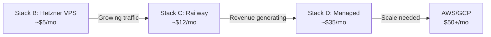

# Deployment Options for My Island

> [!info] Last Updated
> February 2026 — Prices verified against provider websites

## Infrastructure Requirements

| Component | Technology | Minimum Spec |
|-----------|-----------|-------------|
| Frontend | React 19 SPA (static files) | CDN / static hosting |
| Backend | Spring Boot 3.4 / Java 21 | 512MB-1GB RAM |
| Database | PostgreSQL 17 | 500MB+ storage |
| Object Storage | S3-compatible (image uploads) | ~10GB initially |
| Email | Transactional (booking confirmations) | ~100-500/month initially |
| Domain | `.ie` custom domain | — |
| SSL | Required | Free via Let's Encrypt |

---

## Recommended Stacks

> [!tip] TL;DR
> **Start with Stack B** (~$5/month) for best value, or **Stack C** (~$12/month) if you want zero server management.

| Stack | Monthly Cost | Best For |
|-------|-------------|----------|
| [[#Stack A — Maximum Free\|A: Maximum Free]] | ~$1.50 | Side project, zero-budget |
| [[#Stack B — Best Value MVP (Recommended)\|B: Best Value MVP]] | **~$5.35** | **Budget-conscious MVP** |
| [[#Stack C — PaaS Convenience\|C: PaaS Convenience]] | ~$10-15 | Developer speed, no ops |
| [[#Stack D — Production-Ready\|D: Production-Ready]] | ~$28-42 | Revenue-generating app |

---

## Stack A — Maximum Free

**Total: ~$1.50/month** (domain cost only)

| Component | Provider | Cost |
|-----------|----------|------|
| Frontend | Cloudflare Pages | $0 |
| Backend | Oracle Cloud Always Free (ARM A1) | $0 |
| Database | Neon Free Tier | $0 |
| Object Storage | Cloudflare R2 Free Tier | $0 |
| Email | Resend Free Tier | $0 |
| Domain | .ie domain (~EUR 17/yr) | ~$1.50/mo |
| SSL | Let's Encrypt | $0 |

> [!success] Pros
> - Nearly free — Oracle ARM instances offer up to 4 OCPUs and 24GB RAM
> - Neon's serverless PostgreSQL auto-sleeps when idle
> - Cloudflare R2 has zero egress fees

> [!danger] Cons
> - Oracle Cloud instance availability is hit-or-miss (hard to provision in popular regions)
> - ARM architecture — Spring Boot runs fine but needs testing
> - Fully self-managed (Java install, SSL, reverse proxy, backups)
> - Neon free tier limited to 0.5GB storage
> - No deployment pipeline out of the box

---

## Stack B — Best Value MVP (Recommended)

**Total: ~$5.35/month**

| Component      | Provider                           | Cost              |
| -------------- | ---------------------------------- | ----------------- |
| Frontend       | Cloudflare Pages                   | $0                |
| Backend        | Hetzner CX22 VPS (2GB RAM, 2 vCPU) | ~$3.85 (EUR 3.49) |
| Database       | PostgreSQL on same Hetzner VPS     | $0 (shared)       |
| Object Storage | Cloudflare R2 Free Tier            | $0                |
| Email          | Resend Free Tier                   | $0                |
| Domain         | .ie domain                         | ~$1.50/mo         |
| SSL            | Let's Encrypt (Certbot)            | $0                |

> [!success] Pros
> - 2GB RAM is plenty for Spring Boot + PostgreSQL on one box
> - 20TB monthly traffic included
> - EU data centers (low latency for Irish users)
> - x86 architecture — no compatibility concerns
> - Unbeatable price-to-performance ratio

> [!danger] Cons
> - Self-managed: you handle OS updates, security patches, backups
> - No git-push deploys out of the box (can set up CI/CD with GitHub Actions)
> - Single point of failure — DB and app on one server
> - Manual PostgreSQL backup strategy needed

> [!note] Setup Effort
> Medium — install Java 21, PostgreSQL, Nginx (reverse proxy), Certbot, configure firewall. One-time effort of ~2-4 hours.

---

## Stack C — PaaS Convenience

**Total: ~$10-15/month**

| Component | Provider | Cost |
|-----------|----------|------|
| Frontend | Cloudflare Pages or Vercel | $0 |
| Backend | Railway Hobby | $5 (+$2-5 usage) |
| Database | Railway PostgreSQL | ~$1-3 |
| Object Storage | Cloudflare R2 Free Tier | $0 |
| Email | Resend Free Tier | $0 |
| Domain | .ie domain | ~$1.50/mo |
| SSL | Included | $0 |

> [!success] Pros
> - Git-push deploys — push to main and it's live
> - Zero server management
> - Great developer experience
> - Easy to add services (Redis, cron jobs, etc.)
> - Built-in logging and metrics

> [!danger] Cons
> - Usage-based pricing can be unpredictable with Spring Boot's memory footprint
> - Railway Hobby plan has a $5 included credit — Spring Boot apps using ~512MB-1GB RAM may exceed it
> - Less control over infrastructure
> - Railway PostgreSQL has no automated point-in-time recovery on Hobby plan

> [!warning] Watch Out
> Spring Boot's default memory usage (~300-600MB) can eat through Railway's usage-based billing faster than Node.js apps. Monitor usage in the first week.

---

## Stack D — Production-Ready

**Total: ~$28-42/month**

| Component | Provider | Cost |
|-----------|----------|------|
| Frontend | Cloudflare Pages | $0 |
| Backend | DigitalOcean Droplet (2GB) or Railway Pro | $12-20 |
| Database | DigitalOcean Managed PostgreSQL or Neon Launch | $15-19 |
| Object Storage | Cloudflare R2 | $0 (free tier) |
| Email | Resend Free or AWS SES | $0-2 |
| Domain | .ie domain | ~$1.50/mo |
| SSL | Included | $0 |

> [!success] Pros
> - Managed database with automated daily backups
> - Point-in-time recovery
> - Better uptime guarantees and SLAs
> - Easier to scale horizontally
> - Professional monitoring and alerting

> [!danger] Cons
> - Higher cost for an MVP that may not yet have revenue
> - Potentially over-engineered for early stage

---

## Component Breakdown

### Frontend Hosting

All options below have free tiers sufficient for an MVP.

| Provider | Free Bandwidth | Build Mins | Best Feature |
|----------|---------------|------------|-------------|
| **Cloudflare Pages** | **Unlimited** | 500/mo | Zero egress fees |
| Vercel | 100 GB/mo | 6,000/mo | Best React DX |
| Netlify | 100 GB/mo | 300/mo | Form handling |

> [!tip] Recommendation
> **Cloudflare Pages** — unlimited bandwidth at $0. Deploy the Vite build output as a static site.

---

### Backend Hosting

| Provider | Cost/mo | RAM | CPU | Type | Cold Starts? |
|----------|--------|-----|-----|------|-------------|
| Oracle Cloud Free | $0 | Up to 24GB (ARM) | Up to 4 OCPU | IaaS | No |
| Hetzner CX22 | ~$3.85 | 2 GB | 2 shared vCPU | IaaS | No |
| Railway Hobby | $5 (+usage) | Usage-based | Usage-based | PaaS | No |
| DigitalOcean Droplet | $6 | 1 GB | 1 vCPU | IaaS | No |
| Render Starter | $7 | 512 MB | 0.5 CPU | PaaS | No |
| Render Free | $0 | 512 MB | 0.1 CPU | PaaS | **Yes (30-60s)** |
| Fly.io (1GB) | ~$7-8 | 1 GB | Shared | PaaS | No |
| AWS Lightsail | $5 | 512 MB | 1 vCPU | IaaS | No |

> [!warning] Spring Boot Memory
> Spring Boot typically needs 300-600MB RAM at idle. Providers offering only 512MB may struggle under load. 1GB+ recommended.

---

### Database (PostgreSQL)

| Provider | Cost/mo | Storage | Auto-sleep? | Backups |
|----------|--------|---------|------------|---------|
| **Neon Free** | $0 | 0.5 GB | Yes (saves cost) | Branch-based |
| Supabase Free | $0 | 500 MB | **Pauses after 7 days idle** | None |
| Render Free | $0 | 1 GB | No | **Expires in 30 days** |
| Railway | ~$1-3 | Usage-based | No | Manual |
| Self-hosted (on VPS) | $0 extra | Shares VPS disk | No | Manual (pg_dump) |
| Neon Launch | $19 | 10 GB | Yes | Point-in-time |
| DigitalOcean Managed | $15 | Included | No | Daily automated |

> [!warning] Supabase Free Tier
> Pauses after 7 days of inactivity. Not suitable for a production app that needs to be always-on.

> [!tip] Recommendation
> **Neon Free** for managed simplicity, or **self-hosted PostgreSQL** on a Hetzner VPS if you're already paying for one.

---

### Object Storage (Images)

| Provider | Free Tier | Storage Cost | Egress Cost |
|----------|-----------|-------------|-------------|
| **Cloudflare R2** | **10 GB** | $0.015/GB/mo | **$0 (zero)** |
| Backblaze B2 | 10 GB | $0.006/GB/mo | Free via Cloudflare CDN |
| AWS S3 | 5 GB (12 months) | $0.023/GB/mo | $0.09/GB |

> [!tip] Recommendation
> **Cloudflare R2** — S3-compatible API (minimal code changes), zero egress, 10GB free. The app already uses S3 SDK via LocalStack, so switching to R2 is straightforward.

---

### Email (Transactional)

| Provider | Free Tier | Paid Tier | Notes |
|----------|-----------|-----------|-------|
| **Resend** | **3,000/month** | $20/mo for 50K | Modern API, easy setup |
| SendGrid | 100/day (~3K/mo) | $19.95/mo for 50K | Well-established |
| AWS SES | 3,000/mo (12 months) | $0.10 per 1K | Cheapest at scale |
| Mailgun | 100/day | $15/mo for 10K | Comparable to SendGrid |

> [!tip] Recommendation
> **Resend** — 3,000 emails/month free is more than enough for an MVP. Clean API, great docs.

---

### Domain (.ie)

| Registrar | First Year | Renewal/yr |
|-----------|-----------|-----------|
| SmartHost.ie | EUR 2.75 | EUR 19.99 |
| Maxer Host | EUR 8.50 | EUR 16.99 |
| Namecheap | ~$6-15 | ~$15-25 |

Budget ~EUR 15-20/year.

---

## Migration Path

> [!abstract] Strategy
> 1. **Launch** with Stack B (Hetzner + Cloudflare) at ~$5/month
> 2. **Migrate backend** to Railway when you want git-push deploys and less ops
> 3. **Migrate database** to managed PostgreSQL when you need automated backups and point-in-time recovery
> 4. **Scale** to full cloud infrastructure only when traffic and revenue justify it

---

## Deployment Checklist

- [ ] Choose a stack from above
- [ ] Register `.ie` domain
- [ ] Set up frontend hosting (Cloudflare Pages)
- [ ] Configure DNS (domain to Cloudflare)
- [ ] Provision backend server/service
- [ ] Set up PostgreSQL (managed or self-hosted)
- [ ] Create Cloudflare R2 bucket for images
- [ ] Configure Resend for transactional email
- [ ] Set environment variables (JWT secret, DB credentials, Stripe keys, etc.)
- [ ] Set up SSL (automatic on PaaS, Certbot on VPS)
- [ ] Configure production Spring profile
- [ ] Set up CI/CD pipeline (GitHub Actions)
- [ ] Configure backups (database + uploaded images)
- [ ] Set up basic monitoring/alerting
- [ ] Deploy and verify all features work
