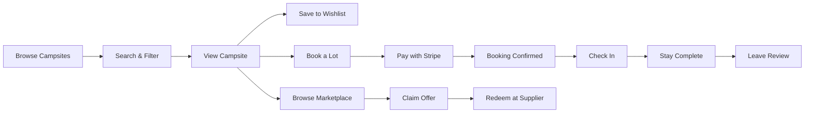
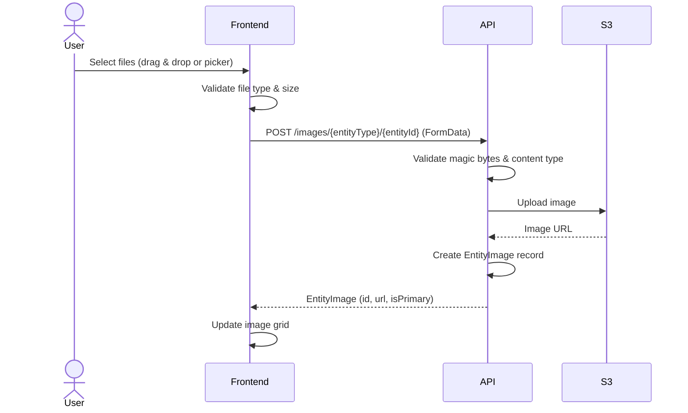
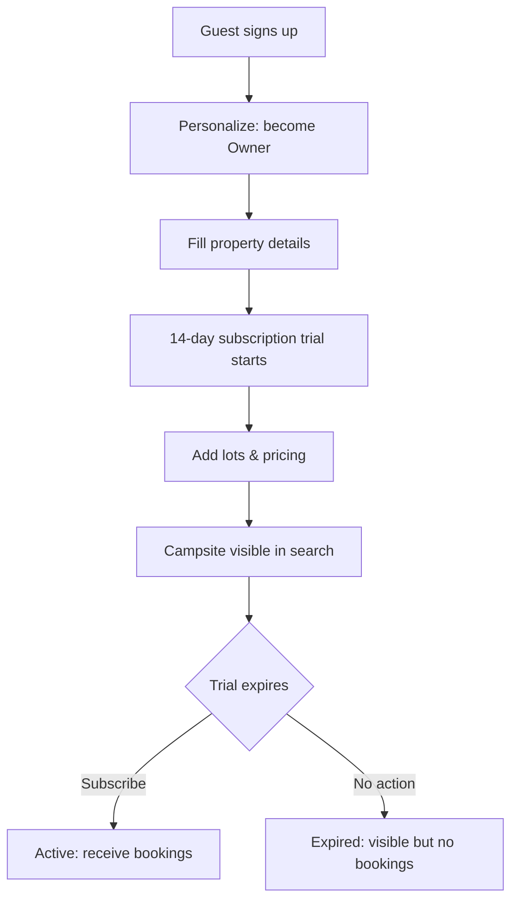
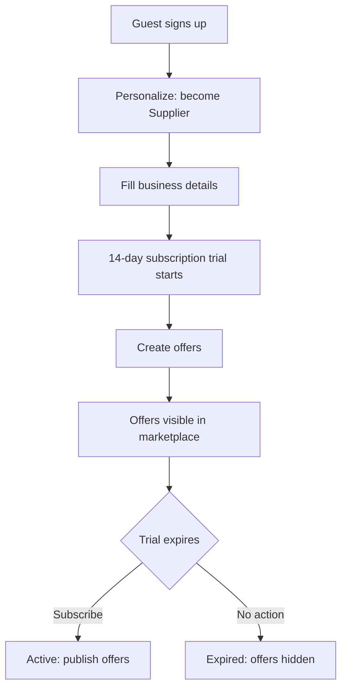

# Visual Flows

Cross-cutting platform flows rendered as Mermaid diagrams. For module-specific state machines and sequences, see the individual module docs under `domain/`.

## User Journey Overview

See also:
- [Booking lifecycle](domain/booking/README.md#booking-status-lifecycle)
- [Payment flow](domain/booking/PAYMENT_FLOW.md)
- [Offer claim flow](domain/marketplace/README.md#offer-claim--redeem-flow)

## Image Upload Flow

See also:
- [Image system notes](domain/accommodation/README.md)

## Owner Onboarding Flow

## Supplier Onboarding Flow

