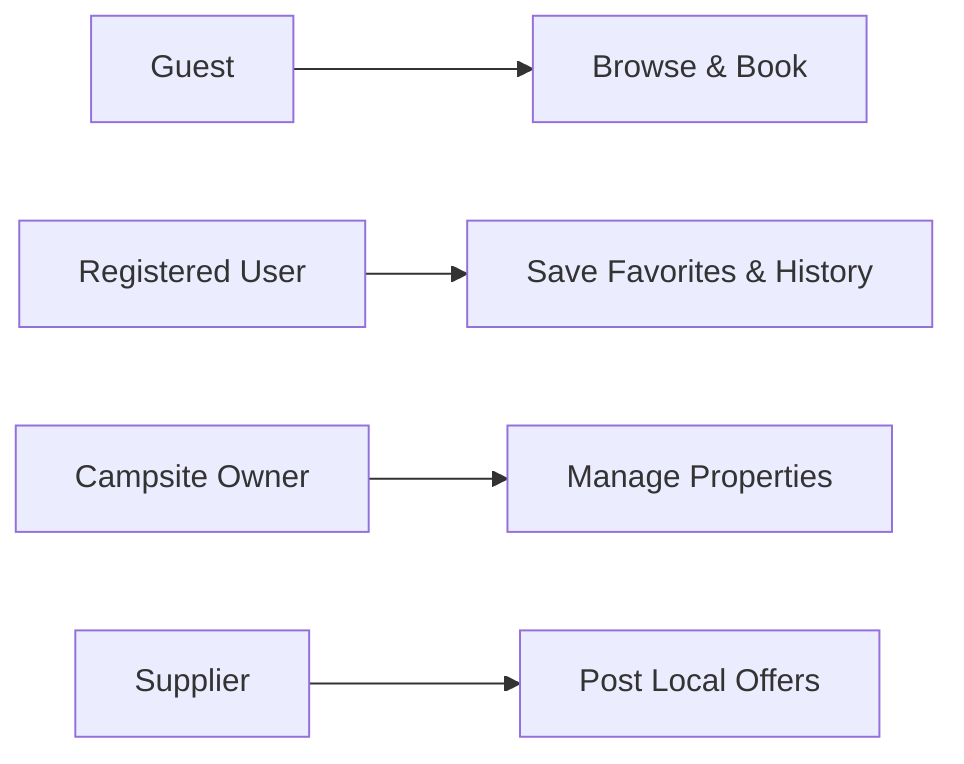

# my-island Documentation

> Camping/glamping booking platform for Ireland - Documentation Hub

---

## Quick Navigation

| Section | Description |
|---------|-------------|
| [[01-Project-Management/README\|Project Management]] | Roadmaps, tasks, and sprint planning |
| [[02-Architecture/README\|Architecture]] | Technical design and domain models |
| [[03-Business/README\|Business]] | Revenue projections and cost estimates |
| [[04-User-Flows/README\|User Flows]] | User journeys, stories, and screen flows |
| [[05-Design-Specs/README\|Design Specs]] | UI/UX specifications and screen designs |
| [[06-Feedback/README\|Feedback]] | User testing and UI reviews |
| [[07-Testing/TESTING_APPROACH\|Testing]] | Backend API testing strategy and patterns |

---

## Project Status

```
MVP Progress: ~75% Complete
├── Frontend: 83 page components
├── Backend: Auth + User APIs complete
├── Mock Data: 120 campsites
└── User Flows: Guest + Owner
```

### Critical Path Items
- [[01-Project-Management/MVP_CRITICAL_TASKS|MVP Critical Tasks]] - Prioritized bug fixes
- [[01-Project-Management/OUTSTANDING_WORK|Outstanding Work]] - Remaining implementation

---

## User Types



| User Type | Primary Flow | Admin Panel |
|-----------|--------------|-------------|
| Guest | [[04-User-Flows/discovery/README\|Discovery]] → [[04-User-Flows/booking/README\|Booking]] | - |
| Registered | All flows + [[04-User-Flows/favorites/README\|Favorites]] | - |
| Owner | [[04-User-Flows/owner-admin/README\|Owner Admin]] | 15+ pages |
| Supplier | [[04-User-Flows/offers/README\|Offers]] management | Coming soon |

---

## Documentation Structure

```
docs/
├── README.md                      # This file (MOC)
├── 01-Project-Management/         # PM docs, roadmaps, tasks
├── 02-Architecture/               # Technical design docs
├── 03-Business/                   # Business planning docs
├── 04-User-Flows/                 # User journeys (was: flows/)
├── 05-Design-Specs/               # Screen designs (was: design/)
├── 06-Feedback/                   # User feedback and reviews
├── 07-Testing/                    # Testing strategy and patterns
└── .obsidian/                     # Obsidian config
```

---

## Key Flows Overview

### Guest Journey
```
Onboarding → Discovery (Map/Search) → Campsite Detail → Booking → Confirmation
```

### Owner Journey
```
Dashboard → Manage Lots → View Bookings → Revenue → Settings
```

### Support Journey
```
Profile → Help & Support → FAQ / Contact Us / Submit Ticket
```

---

## Related Resources

- [[02-Architecture/tech-stack|Tech Stack]] - Full technology overview
- [[05-Design-Specs/ui-style-guide|UI Style Guide]] - Design system reference
- [[04-User-Flows/user-flows|Master User Flows]] - Visual flow diagrams

---

## Getting Started

### For Developers
1. Read [[02-Architecture/README|Architecture Overview]]
2. Review [[02-Architecture/DOMAIN_MODEL|Domain Model]]
3. Check [[01-Project-Management/MVP_CRITICAL_TASKS|Current Tasks]]

### For PMs/Stakeholders
1. Start with [[01-Project-Management/README|Project Status]]
2. Review [[04-User-Flows/README|User Flows]]
3. Check [[06-Feedback/README|User Feedback]]

### For Designers
1. See [[05-Design-Specs/README|Design Specs]]
2. Review [[05-Design-Specs/ui-style-guide|UI Style Guide]]
3. Check [[04-User-Flows/missing-screens|Missing Screens]]

---

## Tags Index

- `#moc` - Map of Content pages
- `#p0` - Critical priority
- `#p1` - High priority
- `#flow` - User flow documentation
- `#design` - Design specifications
- `#owner` - Owner portal related
- `#guest` - Guest experience related
