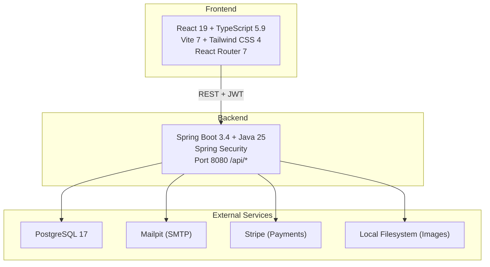
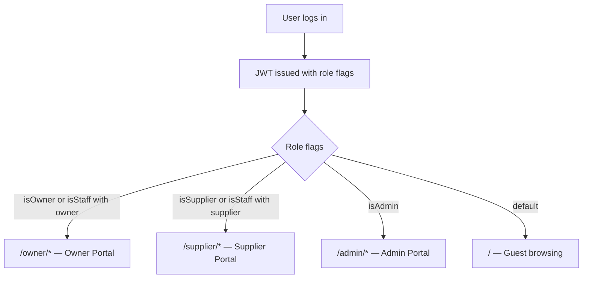

# Architecture Overview

## System Diagram



## Tech Stack

| Layer | Technology |
|-------|------------|
| Frontend | React 19, TypeScript 5.9, Vite 7, Tailwind CSS 4 |
| Routing | React Router 7 |
| Maps | Leaflet + react-leaflet |
| Charts | Recharts |
| Backend | Spring Boot 3.4, Java 25, Spring Security |
| Database | PostgreSQL 17 |
| Migrations | Flyway |
| Events | Spring ApplicationEvents (@Async) |
| Scheduling | Spring @Scheduled + ShedLock |
| Payments | Stripe (Payment Intents, Subscriptions, Connect Express) |
| Auth | JWT (Spring Security, localStorage) |

## Backend Module Structure

```
my-island-api/src/main/java/com/myisland/api/
├── config/                 # Security, Async configs
├── security/               # JWT provider, filter, user details
├── shared/
│   ├── domain/            # Base entity
│   ├── events/            # Application events, async event publisher
│   └── exceptions/        # Global exception handler
└── modules/
    ├── identity/          # User, Auth, Staff, JWT endpoints
    ├── accommodation/     # Owner, Lot, Amenity, Pricing, Featured
    ├── booking/           # Booking, Payment (Stripe intents)
    ├── marketplace/       # Supplier, Offer, Claim, Stripe Connect/Webhooks
    ├── review/            # Campsite reviews, Supplier reviews
    ├── notification/      # Event-driven notifications
    └── discovery/         # Points of Interest, user visits
```

## Frontend Structure

```
my-island-web/src/
├── App.tsx                 # Router with Layout wrapper
├── components/
│   ├── booking/           # BookingModal, PaymentForm
│   ├── explore/           # Map, filters, popups
│   ├── layout/            # Header, BottomNav
│   ├── owner/             # Owner portal components
│   ├── supplier/          # Supplier portal components
│   ├── review/            # Review display, star rating
│   ├── staff/             # StaffManagement
│   └── ui/                # Reusable (ImageUpload, Calendar, etc.)
├── pages/
│   ├── owner/             # Owner dashboard pages
│   └── supplier/          # Supplier dashboard pages
├── context/               # AuthContext
├── services/              # API service modules
└── types/                 # TypeScript type definitions
```

## Key Patterns

| Pattern | Implementation |
|---------|----------------|
| Auth | JWT in localStorage, AuthContext provides user state |
| API calls | `fetch()` with auth headers, no axios |
| Routing | React Router 7, nested routes, role-based guards |
| Path alias | `@/*` → `./src/*` |
| Events | Spring ApplicationEvents → @Async @TransactionalEventListener → email service |
| Payments | Stripe manual capture (authorize → capture) |
| Images | `/api/images/{entityType}/{entityId}` multi-image upload |
| Scheduling | ShedLock for distributed lock, @Scheduled for cron jobs |
| Subscriptions | Stripe-managed with webhook event handling |

## Event & Notification Pipeline

```mermaid
flowchart LR
    Service["Domain Service"] -->|publish| EP["EventPublisher"]
    EP -->|@TransactionalEventListener\nAFTER_COMMIT, @Async| ENS["EmailNotificationService"]
    ENS -->|JavaMailSender| SMTP["SMTP / Mailpit"]
```

Events are published after the transaction commits to avoid sending notifications for rolled-back changes. The `@Async` annotation ensures the calling thread is not blocked by email delivery.

## Portal Access Routing



## GraalVM Native Image Build

The backend supports optional GraalVM Native Image compilation for faster startup (~500ms vs ~5-8s) and lower memory usage (~100-150MB image vs ~300-500MB JRE).

### How It Works

- **Spring Boot AOT** — The `-Pnative` Maven profile activates Spring's ahead-of-time processing, which pre-computes bean definitions and generates reflection metadata at build time
- **`NativeImageConfig.java`** — Programmatic `RuntimeHintsRegistrar` for JJWT, ShedLock, Spring AI, and Loki4j reflection/resource hints
- **`reflect-config.json`** — Manual reflection metadata for the Stripe SDK (Gson-based serialization requires field/constructor access)
- **`resource-config.json`** — Ensures Flyway migrations, Thymeleaf templates, and config files are included in the binary

### Build Commands

```bash
# Local native build (requires GraalVM SDK 21+)
cd my-island-api
./mvnw -Pnative native:compile -DskipTests

# Docker-based native build (no local GraalVM needed)
docker compose build api-native

# Run native API with dependencies
docker compose --profile native up api-native postgres mailpit
```

### Trade-offs

| | JRE (default) | Native Image |
|---|---|---|
| Startup | ~5-8s | ~500ms |
| Docker image | ~300-500MB | ~100-150MB |
| Build time | ~30s | ~5-10 min |
| Peak throughput | Higher (JIT optimized) | Slightly lower |
| Debugging | Full JVM tooling | Limited |

Use native for production deployments where fast startup matters (e.g., auto-scaling). Use JRE for development.

## API Documentation
Live Swagger UI available at `/api/swagger-ui.html` when running.
