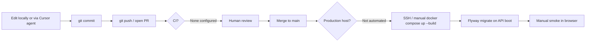

# Current Flow: Commit → Test → Safe → Deploy

How My Island is built, verified, and “deployed” **as of the repo state today**. There is no git-push production pipeline.

---

## 1. How deploy works today

### Reality check

Production deployment is **documented as options** (`docs/DEPLOYMENT_OPTIONS.md`) and **scripted for a single host via Docker Compose**, but:

- There is **no `.github/workflows` CI/CD** in the repository.
- Roadmap still lists “Production environment deployment” as a pre-launch checklist item.
- No staging or production host, secrets store, or deploy credentials are defined in-repo.

What exists is a **manual compose-based deploy recipe**.

### Production compose (manual)

```bash
cp .env.prod.example .env.prod
# fill secrets: POSTGRES_PASSWORD, JWT_SECRET, Stripe, SMTP, CORS, FRONTEND_URL

docker compose -f docker-compose.prod.yml --env-file .env.prod up -d --build

# Optional AI moderation stack:
docker compose -f docker-compose.prod.yml --profile ai --env-file .env.prod up -d --build
```

**`docker-compose.prod.yml` services:**

| Service | Role |
|---------|------|
| `postgres` | PostgreSQL 17, named volume, healthcheck |
| `api` | Spring Boot (`prod` profile), health via `/api/actuator/health` |
| `web` | Multi-stage Vite build → nginx; proxies `/api/` to `api:8080`; publishes host port `WEB_PORT` (default 80) |
| `moderator` + `ollama` | Optional (`ai` profile) |

**Not included in prod compose:** Grafana, Prometheus, Loki, Mailpit, seed data.

**What a “deploy” actually does today:** rebuild images on the target machine and recreate containers. Migrations run on API startup via Flyway (`classpath:db/migration` only — **no** `db/seed` in prod). Uploads persist on a Docker volume.

### Local “run the app” (not production)

Two common paths:

**A. Operator script (hybrid)** — `./start.sh` / `./start.sh --prod`

1. Stops local processes + `docker compose down -v` (wipes DB volumes).
2. Cleans Maven/`dist`/`uploads`/logs.
3. Starts Docker infra: postgres (+ mailpit, ollama, grafana, prometheus, loki in **dev**).
4. Builds API JAR with `./mvnw package -DskipTests` and runs it with `nohup`.
5. Starts Vite frontend with `nohup npm run dev`.
6. Optionally starts Stripe CLI webhook forward.
7. Opens browser tabs (app, Swagger, Grafana, etc.).

Logs land in `logs/backend.log`, `logs/frontend.log`, `logs/build.log`.

**B. Full Docker Compose** — `docker compose up -d`

Builds/runs `api`, `web` (dev Dockerfile + volume mount), postgres, mailpit, ollama, moderator, and observability (Grafana/Prometheus/Loki/Alertmanager).

**Stop:** `./stop.sh` (add `-k` to remove volumes).

---

## 2. Commit → deploy path (today)



| Step | What happens | Automation? |
|------|--------------|-------------|
| Author change | IDE / Cursor Cloud Agent (branch `cursor/…`, commit, push, PR) | Agent can create/act on code |
| Review | Human on GitHub | Partial (Bugbot/security review agents exist as Cursor tools; not required) |
| CI on PR | **Missing** — no workflow files | No |
| Merge | Human merge to `main` | No auto-merge gates |
| Build artifacts | On deploy host: Docker build or `mvnw package` | Manual |
| Deploy | `docker compose -f docker-compose.prod.yml … up -d --build` | Manual |
| Post-deploy verify | Human + optional local scripts | Manual |
| Rollback | Redeploy previous image/tag or git checkout + rebuild | Manual; no documented rollback runbook |

**Cloud Agent constraints that matter for this path:**

- Agents can branch, commit, push, and open/update PRs.
- `gh` CLI is **read-only** (inspect CI/PRs; cannot merge or change GitHub settings).
- There is **no deploy MCP** and no production SSH/kube/cloud credentials in the agent environment for this repo.

---

## 3. Test E2E and “confirm safe”

There is **no single automated “safe to deploy” gate**. Safety is a **manual composition** of local checks.

### 3.1 Frontend E2E (primary UI confidence)

- **Tool:** Playwright (`my-island-web/`)
- **Run:** `cd my-island-web && npm run test:e2e`
- **Requires:** App already running at `http://localhost:5173` (Playwright does not start the stack).
- **Config:** Chromium only, mobile viewport, video/screenshot on, **1 worker**, no retries.
- **Coverage:** ~24 spec files; audit (~2026-02-14) estimated ~76% feature coverage with known gaps (discovery, some admin/supplier flows, password reset UI, etc.).

### 3.2 Backend unit / integration

- **Tool:** Maven Surefire under `my-island-api`
- **Run:** `cd my-island-api && ./mvnw test`
- **Note:** `./start.sh` builds with **`-DskipTests`**, so a normal local start does **not** prove tests passed.

### 3.3 Backend Cucumber / Selenium E2E

- Feature files under `my-island-api/src/test/resources/features/`
- Steps + WebDriver hooks under `…/e2e/`
- Separate from Playwright; also expects a running UI/API.

### 3.4 Load / capacity (not a merge gate)

- Gatling project in `gatling/`
- Profiles: `smoke` (~1 min), `load`, `stress`
- Assertions: p95 &lt; 2s global, failure rate &lt; 1%, etc.
- Manual: `mvn gatling:test -Dprofile=smoke`

### 3.5 Ad-hoc verification scripts

- `verify_subscription_flow.sh` — curl-based supplier subscription happy path against local API
- `verify_unique_logins.sh` — login sanity

These are **not** wired into CI or `start.sh`.

### 3.6 What “confirm safe” means today

| Check | Typical owner | Blocks merge/deploy? |
|-------|---------------|----------------------|
| TypeScript build | Human: `npm run build` | Only if someone remembers |
| ESLint | Human: `npm run lint` | No |
| Maven unit tests | Human: `./mvnw test` | No |
| Playwright E2E | Human against local stack | No |
| Gatling smoke | Optional | No |
| Security audits in `docs/audits/` | Historical reports | No automated re-run |
| Actuator health | Docker healthcheck / curl | Only after containers start |
| Observability green | Glance at Grafana (local only) | No |

**Bottom line:** “Safe” is a human judgment call. The repo has strong **local** test assets but **zero enforced pipeline** that must pass before `main` or production.

---

## 4. Observability as used in the current flow

### Local (dev compose / `start.sh`)

| Signal | Mechanism |
|--------|-----------|
| Metrics | Micrometer → `/api/actuator/prometheus`; Prometheus scrapes `api:8080` every 15s |
| Logs | API Logback Loki4j appender → `http://localhost:3100/loki/api/v1/push`; console + `logs/*.log` |
| UI | Grafana `:3000` (admin/admin) with Prometheus + Loki datasources provisioned |
| Alerts | **None** — no Alertmanager, no provisioned alert rules/dashboards beyond datasources |

**Caveats:**

- Security allows anonymous `/actuator/health` only; **`/actuator/prometheus` is authenticated** unless reached in a way that bypasses that (scraping from Docker network still hits Spring Security). This can break or empty Prometheus scrapes unless credentials or a permitAll rule are added.
- Prod compose **omits** Prometheus/Grafana/Loki entirely.
- Loki receives API logs when the API process can reach Loki; other containers (web, postgres, moderator) are not systematically shipped unless configured separately.

### MCP wiring for a local engineer (`.mcp.json`)

Configured for a **developer machine**, not the cloud agent:

| Server | Intent |
|--------|--------|
| `postgres` | Read SQL against local `myisland` DB |
| `docker` | Inspect/manage local containers |
| `filesystem` | Path hardcoded to a personal laptop directory |
| `context7` / `memory` | Docs/memory helpers |

Cloud Agent runs with a **different** MCP set (Cursor cloud diagnostics, subscriptions, optional Google APIs). Local `.mcp.json` servers are not the same as what the cloud agent has unless the environment is built to include them.

---

## 5. Practical “happy path” for a change today

1. Create a branch; implement; update module docs per CLAUDE.md.
2. Locally: `./start.sh` (or compose), then `./mvnw test`, `npm run lint` / `build`, `npm run test:e2e`.
3. Optionally Gatling smoke.
4. Push PR; wait for human review (no CI).
5. Merge to `main`.
6. On a provisioned VPS (if you have one): pull, `docker compose -f docker-compose.prod.yml --env-file .env.prod up -d --build`.
7. Hit health + critical flows in a browser; check Stripe/email if configured.

Steps 2 and 6–7 are where full automation is incomplete; see [AUTOMATION_GAPS.md](AUTOMATION_GAPS.md).
