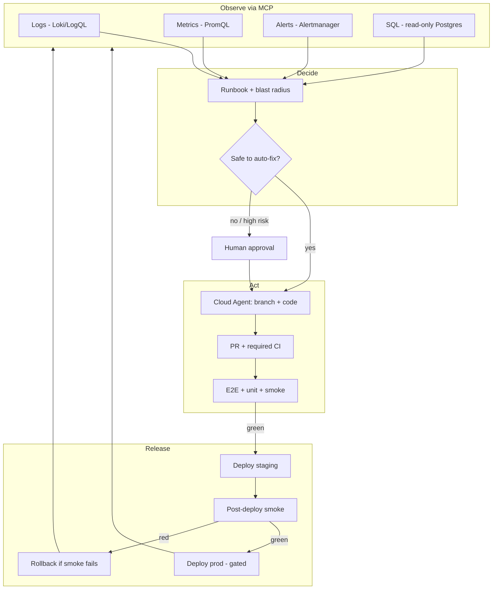

# Target Automation Loop

Desired closed loop for a Java engineer using AI + MCP to run My Island with minimal manual ops. This is the **north star**, not the current system. See [CURRENT_FLOW.md](CURRENT_FLOW.md) and [AUTOMATION_GAPS.md](AUTOMATION_GAPS.md).

---

## Loop

---

## MCP capability map (target)

| Need | MCP / integration | Access |
|------|-------------------|--------|
| Logs | Loki or cloud logging MCP | Staging + prod read |
| Metrics | Prometheus or Grafana MCP | Staging + prod read |
| Alerts | Alertmanager webhook → Cursor automation / agent spawn | Write: create incident thread; Read: alert history |
| SQL | Postgres MCP | **Read-only** role, statement timeout, staging first |
| Containers | Docker or orchestrator MCP | Staging; prod tightly scoped |
| Change | Cursor Cloud Agent + git | Feature branches + PRs |
| CI status | `subscribe_github_ci` | After workflows exist |
| Deploy | Deploy MCP or GitHub Environment deploy | Staging auto; prod approval |

---

## Safety contract (target)

An automated change is “confirmed safe” only when **all** are true:

1. Required CI checks green on the PR head (unit, build, Playwright against ephemeral stack).
2. Staging deploy succeeded and post-deploy smoke passed (health + critical journeys: login, browse, booking path gated by feature toggle policy).
3. Metrics within burn-rate budgets for a soak window (error rate, latency, payment webhook failures).
4. No open Sev-1 alerts on the releasing service.
5. For prod: human or policy approval when the change touches payments, auth, migrations with backfill, or feature toggles that expose booking.

Migrations: expand/contract preferred; agent must not run irreversible data deletes via SQL MCP.

---

## Minimum viable automation (first slice)

**Shipped (Jenkins, this repo):** GitHub PR → Maven/npm CI → Ollama AI review → autofix → squash-merge → compose prod deploy → `confirm-prod.sh`.

Still open:

1. Playwright as a required PR gate (`RUN_E2E` is opt-in).
2. Staging compose host with Grafana/Prometheus/Loki + read-only DB MCP.
3. Agent can query staging logs/metrics/SQL and wait on Jenkins via an MCP/API bridge.
4. Alert-driven Cloud Agent spawn.

See [JENKINS.md](JENKINS.md).
