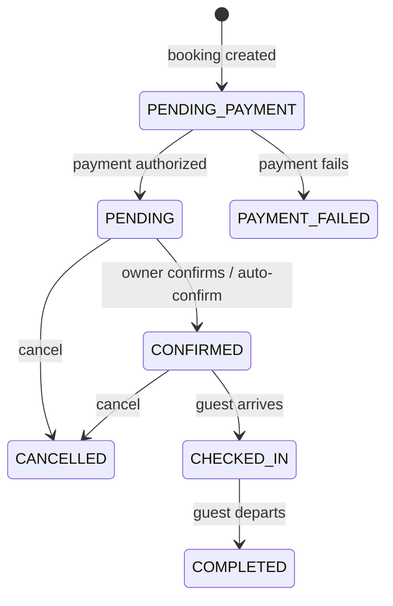
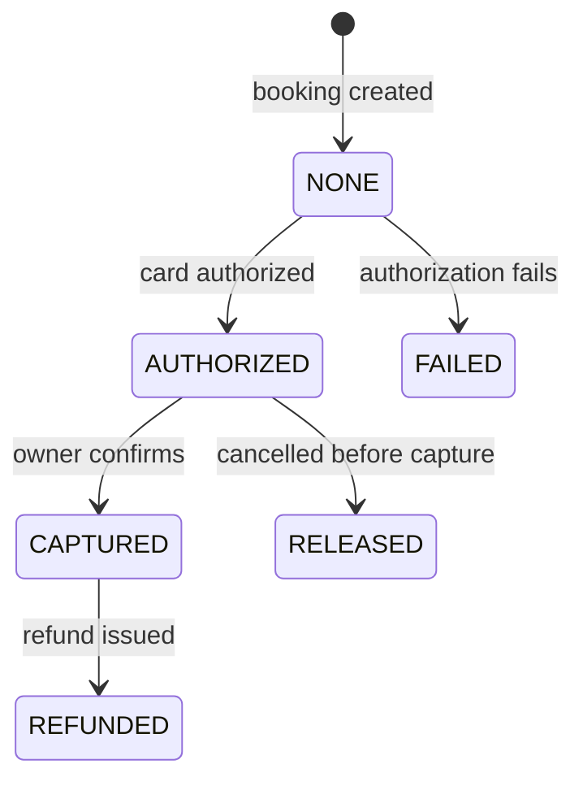
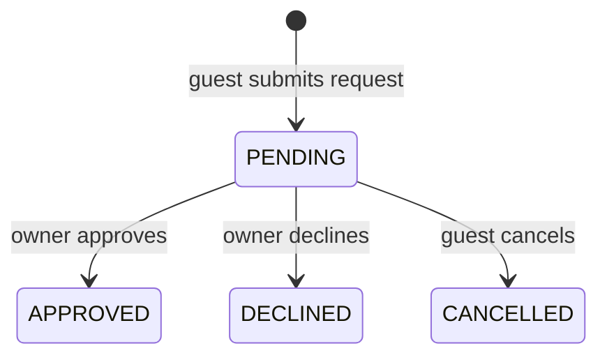
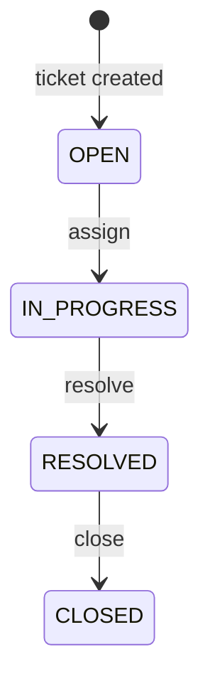
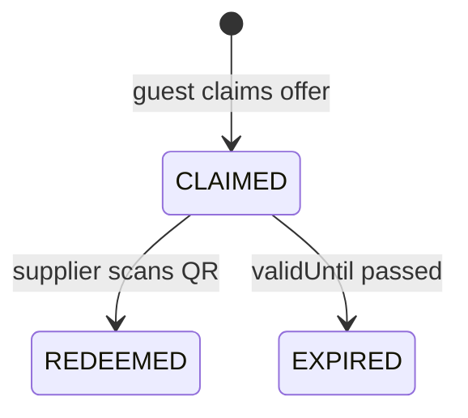
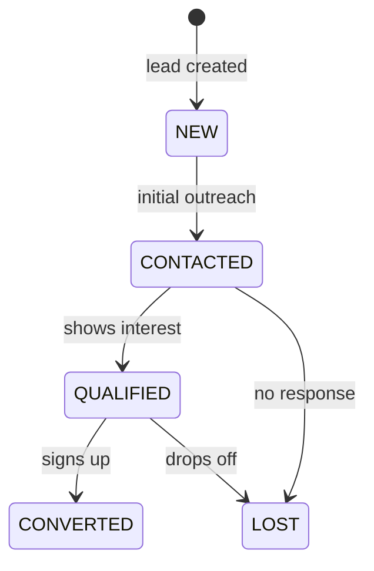
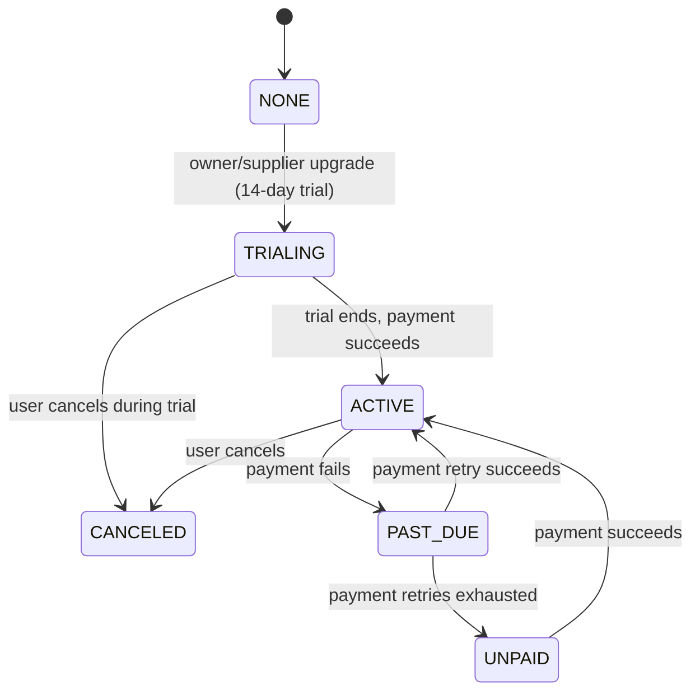
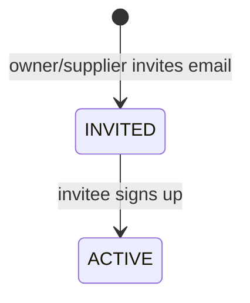
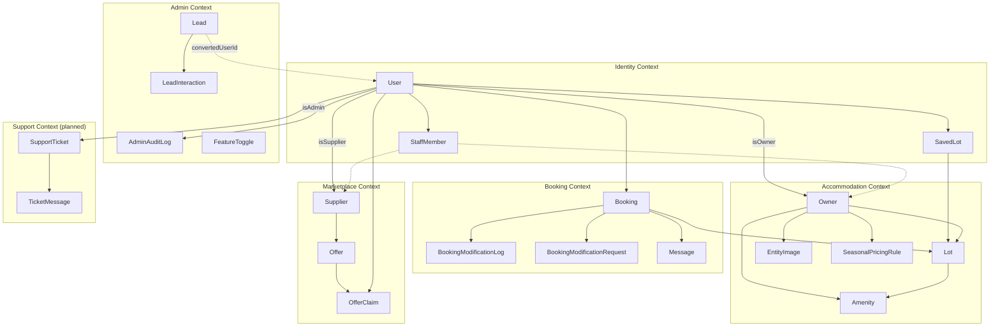

# Domain-Driven Design Model

This document defines the domain objects, states, bounded contexts, and ubiquitous language for the my-island camping/glamping booking platform.

## Implementation Status

| Context | Status | Notes |
|---------|--------|-------|
| Accommodation | Implemented | Campsite, Lot, Amenity, Image management, Owner onboarding |
| Admin | Implemented | Platform admin portal, audit logging, lead CRM, financial reporting |
| Booking | Implemented | Booking CRUD, Stripe payment intents (authorize/capture), trip viewing |
| Identity | Partially implemented | Email auth, password reset, email verification, profile editing. No social auth or account deletion |
| Review | Implemented | Review & SupplierReview entities, AI moderation pipeline, admin moderation |
| Communication | Partially implemented | In-app messaging (per-booking threads between guests and owners). No email delivery yet. |
| Support | Implemented | Ticket-based support with threaded conversations, admin management |
| Marketplace | Implemented | Supplier onboarding, Offer CRUD, Claim/Redeem with QR codes, test claims |
| Subscription | Implemented | Stripe subscriptions for Owners and Suppliers, featured promotions |
| Payout | Implemented | Stripe Connect Express onboarding for Owners and Suppliers |

---

## Ubiquitous Language

### Core Terms

| Term                      | Definition                                                                                                      |
| ------------------------- | --------------------------------------------------------------------------------------------------------------- |
| **Campsite**              | A site type. A property offering outdoor accommodation (camping, glamping, cabins). Owned by exactly one Owner. |
| **Lot**                   | A bookable unit within a Campsite (e.g., tent pitch, cabin, glamping pod). Has a type and capacity.             |
| **Guest**                 | A user who browses and books accommodations.                                                                    |
| **Owner**                 | A user who owns and manages one or more Campsites.                                                              |
| **Supplier**              | A business partner offering local deals and experiences to Guests.                                              |
| **Booking**               | A reservation for a specific Lot over a date range.                                                             |
| **Extra**                 | An add-on service or product available with a Booking (e.g., firewood, bike rental).                            |
| **Facility**              | An amenity available at a Campsite (e.g., WiFi, showers, playground).                                           |
| **Check-In Instructions** | Arrival information provided to Guests before their stay.                                                       |
| **Offer**                 | A promotional deal from a Supplier for Guests.                                                                  |
| **Review**                | Guest feedback submitted after completing a Booking.                                                            |

### Subscription Terms

| Term | Definition |
|------|-------------|
| **Subscription** | Monthly recurring payment required for Owners and Suppliers to access premium features. |
| **Featured Promotion** | One-time payment (7 days €9.99 or 30 days €29.99) to promote a property or business on the homepage/marketplace. |
| **Connect Account** | Stripe Connect Express account that enables Owners/Suppliers to receive payouts from bookings and offer redemptions. |
| **Payouts Enabled** | Status indicating a Connect account has completed onboarding and can receive payments. |

### User Roles

| Role | Description |
|------|-------------|
| **Anonymous User** | Can browse campsites and search. Cannot book or save favorites. |
| **Guest** | Registered user. Can book, save favorites, receive notifications, and write reviews. |
| **Owner** | Registered user with `isOwner=true`. Manages campsites, lots, bookings, and responds to reviews. Requires subscription to receive bookings and access analytics. Can set up Stripe Connect to receive booking payments. |
| **Supplier** | Registered user with `isSupplier=true`. Creates and manages promotional offers. Requires subscription to create offers. Can set up Stripe Connect to receive offer redemption payments. |
| **Staff** | Registered user with `isStaff=true`. Granted access to Owner and/or Supplier portals via staff membership. Full portal access (ACL deferred). |
| **Admin** | Registered user with `isAdmin=true`. Platform superuser with access to the admin portal for platform-wide administration. Set directly in the database. |

---

## Bounded Contexts

### 1. Accommodation Context
**Purpose**: Manage campsite inventory, lots, and availability.

**Aggregates**: Campsite (as Owner), Lot, Amenity, EntityImage

> **Not yet built**: Extra, LotAvailability (date blocking), CheckInInstructions

**Key Operations**:
- Create/update campsite details
- Manage lot inventory and pricing
- Set availability calendar
- Configure check-in instructions

### 2. Booking Context
**Purpose**: Handle the reservation lifecycle from search to completion.

**Aggregates**: Booking

> **Not yet built**: BookingExtra (extras system)

**Key Operations**:
- Create booking
- Process payment (Stripe authorize/capture)
- Cancel booking (backend only, no UI yet)
- Confirm booking (owner approves, payment captured)

> **Not yet built**: Add extras to booking, check-in guest, manual completion

### 3. Identity Context
**Purpose**: User authentication, profiles, and preferences.

**Aggregates**: User

> **Not yet built**: LinkedAccount, full NotificationPreferences

**Key Operations**:
- Register/login via email
- Password reset via email link
- Email verification
- Update profile (name)
- Upgrade to Owner or Supplier

> **Not yet built**: Social login, link social accounts, delete account, update photo/bio

### 4. Review Context — *Not Yet Built*
**Purpose**: Guest feedback and ratings system.

**Aggregates**: Review

**Key Operations** (planned):
- Submit review (post-checkout only)
- Rate by category
- Owner response
- Mark as helpful

### 5. Communication Context — *Partially Implemented*
**Purpose**: Messaging between guests and hosts.

**Aggregates**: Message

**Key Operations**:
- Send message in a booking conversation
- Get conversation messages (auto-marks received as read)
- Get unread message counts per booking
- Get owner conversation list with latest message summary

> **Not yet built**: Email delivery for new messages, system notifications, booking reminders, push notifications

### 6. Support Context — *Not Yet Built*
**Purpose**: Customer service and issue resolution.

**Aggregates**: SupportTicket, TicketMessage

**Key Operations** (planned):
- Create ticket
- Staff response
- Resolve/close ticket

### 7. Marketplace Context
**Purpose**: Partner offers and local experiences.

**Aggregates**: Supplier, Offer, OfferClaim

**Key Operations**:
- Create supplier profile
- Publish offers (requires active subscription)
- Browse marketplace (query available offers)
- View offer details
- Claim offers (Guest claims offer, receives voucher)
- Redeem claims (Supplier marks voucher as used)
- Purchase featured promotion

### 8. Subscription Context
**Purpose**: Manage recurring subscriptions, one-time promotions, and payment collection.

**Aggregates**: Subscription, SetupIntent, ConnectAccount

**Key Operations**:
- Create setup intent for card collection
- Confirm subscription with payment method
- Create checkout session (legacy redirect flow)
- Handle webhook events (subscription created, updated, deleted, account.updated)
- Check subscription status
- Purchase featured promotion
- Expire featured listings (scheduled job)

### 9. Payout Context
**Purpose**: Enable Owners and Suppliers to receive payments via Stripe Connect.

**Key Operations**:
- Create Connect Express account
- Generate onboarding link
- Check onboarding status
- Verify payouts enabled
- Handle account.updated webhooks

### 10. Admin Context
**Purpose**: Platform administration, audit logging, lead CRM for campsite partnerships, and feature toggle management.

**Aggregates**: AdminAuditLog, Lead (with LeadInteraction), FeatureToggle

**Key Operations**:
- Dashboard KPIs and activity feed
- Manage users, bookings, owners, suppliers, reviews
- Toggle user active status
- Verify suppliers
- Flag and delete reviews
- Financial reporting with CSV export
- Lead CRM with scoring, interactions, and follow-up tracking
- Audit logging of all admin actions with before/after snapshots
- Feature toggle management (e.g., SUBSCRIPTION_ENFORCEMENT)

---

## Aggregates & Entities

### Campsite Aggregate

> **Note**: In the current implementation, the Owner entity serves as the Campsite root (one owner = one campsite). The `Campsite` concept maps to the Owner's property.

```
Owner / Campsite (Root)
├── Location (county, town, lat/lng)
├── Lot[] (Entity)
│   ├── LotType (Enum)
│   └── Amenity[] (ManyToMany)
├── SeasonalPricingRule[] (Entity)
├── Amenity[] (ManyToMany, property-level)
├── EntityImage[] (Entity)
├── Extra[] (Entity)              — NOT YET BUILT
├── CheckInInstructions (Entity)  — NOT YET BUILT
└── Review[] (weak reference)     — NOT YET BUILT
```

**Owner / Campsite**

| Field | Type | Description |
|-------|------|-------------|
| id | Long | Unique identifier |
| userId | Long | Reference to User |
| propertyName | String | Display name |
| propertyType | PropertyType | Type of accommodation business |
| description | String | Long description |
| county | String | County location |
| town | String | Town location |
| latitude | BigDecimal | GPS latitude |
| longitude | BigDecimal | GPS longitude |
| phone | String | Contact phone |
| website | String | Business website URL |
| isFeatured | Boolean | Promoted on homepage |
| featuredUntil | DateTime | When featured expires |
| isAcceptingBookings | Boolean | Whether online booking is enabled |
| lots | Lot[] | OneToMany |
| amenities | Amenity[] | ManyToMany |

> **Not in current implementation**: rating, reviewCount (requires Review module)

**Lot**

| Field | Type | Description |
|-------|------|-------------|
| id | Long | Unique identifier |
| ownerId | Long | Parent owner/campsite |
| name | String | Lot name (e.g., "Pitch A1") |
| lotType | LotType | Accommodation type (TENT, TOURING, GLAMPING, CABIN, MOBILE_HOME) |
| description | String | Lot description |
| maxGuests | Integer | Maximum guests (default 2) |
| pricePerNight | BigDecimal | Base price |
| minStay | int | Minimum nights per booking (default 1) |
| isActive | Boolean | Currently bookable |
| imageUrl | String | Legacy single image URL |
| amenities | Amenity[] | ManyToMany, lot-specific amenities |

> Images are now managed via the EntityImage system (multi-image with primary selection).

**SeasonalPricingRule**

| Field | Type | Description |
|-------|------|-------------|
| id | Long | Unique identifier |
| ownerId | Long | Parent owner/campsite |
| lotType | LotType | Which lot type this rule applies to |
| name | String | Rule name (e.g., "Summer Peak") |
| startDate | LocalDate | Season start date |
| endDate | LocalDate | Season end date |
| pricePerNight | BigDecimal | Override price for the season |
| minStay | Integer | Optional minimum stay override for the season (nullable) |

**Extra** — *Not Yet Built*

| Field | Type | Description |
|-------|------|-------------|
| id | UUID | Unique identifier |
| campsiteId | UUID | Parent campsite (optional for global extras) |
| name | String | Extra name |
| description | String | Details |
| price | Decimal | Cost |
| perNight | Boolean | Charged per night vs. per stay |
| available | Boolean | Currently offered |

> The frontend has a hardcoded "Electric Hookup" add-on for tent pitches, but no backend Extra entity exists.

---

### Booking Aggregate

```
Booking (Root)
├── Payment fields (embedded)
├── BookingModificationLog[] (Entity)
├── BookingModificationRequest[] (Entity)
├── BookingExtra[] (Entity)    — NOT YET BUILT
└── Message[] (cross-ref via booking_id, Communication Context)
```

**Booking**

| Field | Type | Description |
|-------|------|-------------|
| id | Long | Unique identifier |
| userId | Long | Guest who booked |
| lotId | Long | Reserved lot |
| checkInDate | LocalDate | Arrival date |
| checkOutDate | LocalDate | Departure date |
| numGuests | Integer | Number of guests (default 1) |
| status | BookingStatus | Current state |
| totalPrice | BigDecimal | Final amount |
| specialRequests | String | Guest notes |
| stripePaymentIntentId | String | Stripe payment intent ID |
| paymentStatus | PaymentStatus | NONE, AUTHORIZED, CAPTURED, RELEASED, REFUNDED, FAILED |
| paymentCapturedAt | Instant | When payment was captured |
| refundAmount | BigDecimal | Refund amount if applicable |
| serviceFee | BigDecimal | Platform fee |
| chargeTotal | BigDecimal | Total charge amount |
| reviewEmailSentAt | Instant | When post-stay review request email was sent |
| stripeTransferId | String | Stripe transfer ID for owner payout |
| createdAt | Timestamp | Booking creation time |

**BookingModificationLog**

| Field | Type | Description |
|-------|------|-------------|
| id | Long | Unique identifier |
| bookingId | Long | Modified booking |
| modifiedByUserId | Long | User who made the change |
| modificationType | String | DATE_CHANGE, LOT_CHANGE, DATE_AND_LOT_CHANGE |
| previousLotId | Long | Lot before change |
| previousCheckInDate | LocalDate | Check-in before change |
| previousCheckOutDate | LocalDate | Check-out before change |
| previousTotalPrice | BigDecimal | Price before change |
| newLotId | Long | Lot after change |
| newCheckInDate | LocalDate | Check-in after change |
| newCheckOutDate | LocalDate | Check-out after change |
| newTotalPrice | BigDecimal | Price after change |
| priceAdjustment | BigDecimal | Positive = guest owes more |
| reason | String | Optional reason for modification |
| initiatedBy | String | OWNER or GUEST |
| createdAt | Timestamp | When modification occurred |

**BookingModificationRequest**

| Field | Type | Description |
|-------|------|-------------|
| id | Long | Unique identifier |
| bookingId | Long | Booking being modified |
| requestedByUserId | Long | Guest who submitted the request |
| status | ModificationRequestStatus | PENDING, APPROVED, DECLINED, CANCELLED |
| requestedLotId | Long | Proposed new lot (null = no change) |
| requestedCheckInDate | LocalDate | Proposed new check-in (null = no change) |
| requestedCheckOutDate | LocalDate | Proposed new check-out (null = no change) |
| requestedWantsPower | Boolean | Proposed power hookup (null = no change) |
| estimatedNewPrice | BigDecimal | Calculated new total price |
| priceDifference | BigDecimal | Difference from current price |
| reason | String | Guest's reason for modification |
| resolvedByUserId | Long | Owner/staff who approved/declined |
| resolvedAt | Timestamp | When resolved |
| declineReason | String | Reason for declining |
| createdAt | Timestamp | Request creation time |
| updatedAt | Timestamp | Last update |

**BookingExtra** — *Not Yet Built*

| Field | Type | Description |
|-------|------|-------------|
| id | UUID | Unique identifier |
| bookingId | UUID | Parent booking |
| extraId | UUID | Reference to Extra |
| quantity | Integer | Amount ordered |
| unitPrice | Decimal | Price at time of booking |
| totalPrice | Decimal | quantity x unitPrice |

---

### User Aggregate

```
User (Root)
├── StaffMember[] (Entity)                 — Staff memberships for Owner/Supplier portals
├── SavedLot[] (Entity)                    — Persisted favorites (API for auth users, localStorage for anonymous)
├── LinkedAccount[] (Entity)               — NOT YET BUILT
└── NotificationPreferences (Value Object) — NOT YET BUILT (Owner has partial prefs)
```

> **Note**: The `Supplier` entity is owned by the **Marketplace Context**, not Identity.
> Users with `isSupplier=true` can create a Supplier profile there. See [Identity Notes](identity/NOTES.md) for boundary details.

**User**

| Field | Type | Description |
|-------|------|-------------|
| id | Long | Unique identifier |
| email | String | Login email (unique) |
| passwordHash | String | Encrypted password |
| name | String | Display name |
| role | UserRole | Primary role (GUEST, OWNER, SUPPLIER, STAFF) |
| isOwner | Boolean | Has campsite management access |
| isSupplier | Boolean | Has supplier dashboard access |
| isStaff | Boolean | Has staff access via StaffMember membership |
| isAdmin | Boolean | Platform admin with access to admin portal |
| isActive | Boolean | Account active status (default true). Disabled users cannot log in. |
| emailVerified | Boolean | Email verification status |
| emailVerificationToken | String | Token for email verification |
| emailVerificationTokenExpiry | DateTime | Token expiry |
| passwordResetToken | String | Token for password reset |
| passwordResetTokenExpiry | DateTime | Token expiry |
| createdAt | Timestamp | Account creation |
| updatedAt | Timestamp | Last update |

> **Not in current implementation**: avatar (uses UI Avatars service), phone, bio, NotificationPreferences on User entity (Owner entity has partial preference fields)

**StaffMember**

| Field | Type | Description |
|-------|------|-------------|
| id | Long | Unique identifier |
| email | String | Whitelisted email (always set) |
| ownerId | Long | Reference to Owner (nullable) |
| supplierId | Long | Reference to Supplier (nullable) |
| userId | Long | Reference to User (null if not yet signed up) |
| status | StaffStatus | INVITED (pending signup) or ACTIVE (linked) |
| createdAt | Timestamp | When invitation was created |
| updatedAt | Timestamp | Last update |

> At least one of `ownerId` or `supplierId` must be set. When a user signs up with a matching email, the membership is auto-activated and `isStaff` is set on the User.

**SavedLot** (extends BaseEntity)

| Field | Type | Description |
|-------|------|-------------|
| id | Long | Unique identifier |
| userId | Long | FK to User — the guest who saved the lot |
| lotId | Long | FK to Lot — the saved lot |
| createdAt | Timestamp | When the lot was saved |
| updatedAt | Timestamp | Last update |

> Unique constraint on `(user_id, lot_id)`. Cascade delete on both User and Lot. Indexed on `user_id`. Anonymous users fall back to localStorage; on login, localStorage favorites are merged via the bulk endpoint and then cleared.

**LinkedAccount** — *Not Yet Built*

| Field | Type | Description |
|-------|------|-------------|
| id | UUID | Unique identifier |
| userId | UUID | Parent user |
| provider | SocialProvider | OAuth provider |
| email | String | External account email |
| connected | Boolean | Currently linked |

---

### Owner Aggregate

```
Owner (Root)
├── Campsite[] (Entity, cross-aggregate reference)
├── Subscription (Value Object)
└── ConnectAccount (Value Object)
```

**Owner**

| Field | Type | Description |
|-------|------|-------------|
| id | UUID | Unique identifier |
| userId | UUID | Reference to User |
| propertyName | String | Business/property display name |
| propertyType | PropertyType | Type of accommodation business |
| subscriptionStatus | SubscriptionStatus | Current subscription state |
| stripeCustomerId | String | Stripe customer ID for billing |
| stripeSubscriptionId | String | Active subscription ID |
| currentPeriodEnd | Timestamp | Subscription renewal date |
| cancelAtPeriodEnd | Boolean | Will cancel at period end |
| featured | Boolean | Promoted on homepage |
| featuredUntil | Timestamp | When featured expires |
| stripeConnectAccountId | String | Stripe Connect account for payouts |
| connectOnboardingComplete | Boolean | Has completed onboarding |
| payoutsEnabled | Boolean | Can receive payments |
| allowGuestModifications | Boolean | Allow guests to modify their bookings (default true) |
| modificationDeadlineDays | Integer | Min days before check-in for guest modifications (default 3) |
| requireModificationApproval | Boolean | Require owner approval for guest modifications (default false) |
| isDeactivated | Boolean | Admin soft-delete / deactivation flag (default false) |

---

### Supplier Aggregate

```
Supplier (Root)
├── Offer[] (Entity)
├── Subscription (Value Object)
└── ConnectAccount (Value Object)
```

**Supplier**

| Field | Type | Description |
|-------|------|-------------|
| id | UUID | Unique identifier |
| userId | UUID | Reference to User |
| businessName | String | Business display name |
| description | String | Business description |
| category | SupplierCategory | Type of business |
| location | String | Business location |
| phone | String | Contact phone |
| website | String | Business website URL |
| subscriptionStatus | SubscriptionStatus | Current subscription state |
| stripeCustomerId | String | Stripe customer ID for billing |
| stripeSubscriptionId | String | Active subscription ID |
| currentPeriodEnd | Timestamp | Subscription renewal date |
| cancelAtPeriodEnd | Boolean | Will cancel at period end |
| featured | Boolean | Promoted in marketplace |
| featuredUntil | Timestamp | When featured expires |
| stripeConnectAccountId | String | Stripe Connect account for payouts |
| connectOnboardingComplete | Boolean | Has completed onboarding |
| payoutsEnabled | Boolean | Can receive payments |
| emailNotifications | Boolean | Email notification preference (default true) |
| newClaimAlerts | Boolean | New claim alert preference (default true) |
| weeklyReport | Boolean | Weekly performance report preference (default false) |
| marketingEmails | Boolean | Marketing email preference (default false) |
| isDeactivated | Boolean | Whether the supplier account is deactivated (default false) |

---

### Review Aggregate — *Implemented*

```
Review (Root)
SupplierReview (Root)
```

**Review**

| Field | Type | Description |
|-------|------|-------------|
| id | Long | Unique identifier |
| user | User | Author (ManyToOne) |
| owner | Owner | Reviewed campsite owner (ManyToOne) |
| booking | Booking | Associated booking (OneToOne, unique) |
| rating | BigDecimal | Overall score (1-5, precision 2 scale 1) |
| comment | String | Review text |
| ownerResponse | String | Host reply (nullable) |
| ownerResponseAt | LocalDateTime | When host replied |
| isFlagged | boolean | Admin flag |
| moderationStatus | ModerationStatus | AI moderation state (PENDING, APPROVED, REJECTED) |
| moderationReason | String | AI or admin moderation reason |
| moderatedAt | LocalDateTime | When moderation decision was made |

**SupplierReview**

| Field | Type | Description |
|-------|------|-------------|
| id | Long | Unique identifier |
| user | User | Author (ManyToOne) |
| supplier | Supplier | Reviewed supplier (ManyToOne) |
| offerClaim | OfferClaim | Associated claim (OneToOne, unique) |
| rating | BigDecimal | Overall score (1-5) |
| comment | String | Review text |
| supplierResponse | String | Supplier reply (nullable) |
| supplierResponseAt | LocalDateTime | When supplier replied |
| isFlagged | boolean | Admin flag |
| moderationStatus | ModerationStatus | AI moderation state (reuses Review.ModerationStatus) |
| moderationReason | String | AI or admin moderation reason |
| moderatedAt | LocalDateTime | When moderation decision was made |

**ModerationStatus** (inner enum on Review)

| Value | Description |
|-------|-------------|
| PENDING | Awaiting AI moderation |
| APPROVED | Passed moderation, publicly visible |
| REJECTED | Failed moderation, hidden from public |

---

### Support Aggregate

```
SupportTicket (Root)
└── SupportTicketMessage[] (Entity)
```

**SupportTicket**

| Field | Type | Description |
|-------|------|-------------|
| id | Long | PK, auto-generated |
| user | User (FK) | Ticket creator |
| subject | String(255) | Issue title |
| description | Text | Issue details |
| category | TicketCategory | GENERAL, BILLING, TECHNICAL, ACCOUNT, BOOKING, OTHER |
| status | TicketStatus | OPEN, IN_PROGRESS, RESOLVED, CLOSED |
| priority | TicketPriority | LOW, NORMAL, HIGH, URGENT |
| relatedBooking | Booking (FK) | Optional booking reference |
| assignedAdmin | User (FK) | Optional admin assignment |
| closedAt | LocalDateTime | Set when resolved/closed |
| createdAt | LocalDateTime | Auto-set |
| updatedAt | LocalDateTime | Auto-updated |

**SupportTicketMessage**

| Field | Type | Description |
|-------|------|-------------|
| id | Long | PK, auto-generated |
| ticket | SupportTicket (FK) | CASCADE delete |
| sender | User (FK) | Message author |
| content | Text | Message body |
| createdAt | LocalDateTime | Auto-set |

---

### AdminAuditLog

```
AdminAuditLog (standalone entity, no aggregate root)
```

**AdminAuditLog**

| Field | Type | Description |
|-------|------|-------------|
| id | Long | Unique identifier |
| adminUserId | Long | Admin who performed the action |
| action | String | Action performed (e.g., "UPDATE_USER", "CANCEL_BOOKING") |
| entityType | String | Type of affected entity (e.g., "USER", "BOOKING") |
| entityId | Long | ID of affected entity |
| summary | String | Human-readable description of the action |
| details | JSONB | Additional action details |
| previousValue | JSONB | Entity state before the action |
| newValue | JSONB | Entity state after the action |
| createdAt | Timestamp | When the action occurred |

---

### Lead Aggregate

```
Lead (Root)
└── LeadInteraction[] (Entity)
```

**Lead** (extends BaseEntity)

| Field | Type | Description |
|-------|------|-------------|
| id | Long | Unique identifier |
| name | String | Contact name |
| email | String | Contact email |
| phone | String | Contact phone |
| businessType | BusinessType | OWNER or SUPPLIER |
| status | LeadStatus | NEW, CONTACTED, QUALIFIED, CONVERTED, LOST |
| source | String | How the lead was found |
| notes | String | Free-text notes |
| assignedTo | String | Admin user handling this lead |
| tags | String | Comma-separated tags |
| score | Integer | Computed score 0-100 |
| scheduledFollowUp | DateTime | Next follow-up date |
| convertedUserId | Long | User ID if converted |
| createdAt | Timestamp | Creation time |
| updatedAt | Timestamp | Last update |

**LeadInteraction**

| Field | Type | Description |
|-------|------|-------------|
| id | Long | Unique identifier |
| leadId | Long | Parent lead |
| type | InteractionType | CALL, EMAIL, MEETING, NOTE |
| content | String | Interaction details |
| createdBy | String | Admin who created the interaction |
| createdAt | Timestamp | When the interaction occurred |

### FeatureToggle

```
FeatureToggle (standalone entity, no aggregate root)
```

**FeatureToggle**

| Field | Type | Description |
|-------|------|-------------|
| id | Long | Unique identifier |
| name | String | Unique toggle name (e.g., SUBSCRIPTION_ENFORCEMENT) |
| enabled | Boolean | Whether the toggle is active |
| description | String | Human-readable description of what the toggle controls |
| category | String | Grouping category (e.g., BILLING, FEATURE) |
| updatedBy | Long | Admin user who last changed the toggle |
| updatedAt | Timestamp | When the toggle was last changed |

---

### Message (Communication Context)

```
Message (standalone entity, references Booking and User)
```

**Message** (extends BaseEntity)

| Field | Type | Description |
|-------|------|-------------|
| id | Long | Unique identifier |
| booking | Booking (FK) | The booking this conversation belongs to |
| sender | User (FK) | User who sent the message |
| content | String (TEXT) | Message body |
| isRead | Boolean | Whether the recipient has read the message (default false) |
| createdAt | Timestamp | When the message was sent |
| updatedAt | Timestamp | Last update |

> Indexed on `booking_id`, `sender_id`, and partial index on `(booking_id, is_read) WHERE is_read = FALSE`.

---

## Value Objects

### Location
| Field | Type |
|-------|------|
| address | String |
| county | String |
| lat | Double |
| lng | Double |

### NotificationPreferences
| Field | Type | Default |
|-------|------|---------|
| email | Boolean | true |
| push | Boolean | true |
| sms | Boolean | false |
| marketing | Boolean | false |

### ReviewCategories
| Field | Type | Range |
|-------|------|-------|
| cleanliness | Integer | 1-5 |
| location | Integer | 1-5 |
| value | Integer | 1-5 |
| facilities | Integer | 1-5 |

---

## Enumerations

### BookingStatus (State Machine)



| Status | Description |
|--------|-------------|
| PENDING_PAYMENT | Booking created, awaiting payment authorization |
| PENDING | Payment authorized, awaiting owner confirmation |
| CONFIRMED | Owner confirmed, payment captured |
| COMPLETED | Stay completed |
| CANCELLED | Booking cancelled |
| PAYMENT_FAILED | Payment authorization failed |

### PaymentStatus (State Machine)



| Status | Description |
|--------|-------------|
| NONE | No payment initiated |
| AUTHORIZED | Card authorized, hold placed (not yet charged) |
| CAPTURED | Payment captured (funds charged) |
| RELEASED | Authorization released without charge |
| REFUNDED | Payment refunded after capture |
| FAILED | Payment authorization failed |

### ModificationRequestStatus (State Machine)



| Status | Description |
|--------|-------------|
| PENDING | Awaiting owner review |
| APPROVED | Owner approved, modification applied |
| DECLINED | Owner declined with optional reason |
| CANCELLED | Guest cancelled their own request |

### TicketStatus — *Not Yet Built*



| Status | Description |
|--------|-------------|
| OPEN | New ticket, awaiting staff attention |
| IN_PROGRESS | Staff investigating |
| RESOLVED | Issue addressed, awaiting confirmation |
| CLOSED | Ticket finalized |

### AvailabilityStatus — *Not Yet Built as Separate Entity*

> The current implementation uses booking date overlap checks to prevent double bookings. There is no separate availability table or manual date blocking for owners.

| Status | Description |
|--------|-------------|
| AVAILABLE | Lot can be booked for this date |
| BOOKED | Reserved by a confirmed booking |
| BLOCKED | Owner has blocked this date |
| MAINTENANCE | Unavailable for maintenance |

### PropertyType

5 types classifying the primary accommodation style of a property. Matches LotType values:

| Type | Label | Description |
|------|-------|-------------|
| TENT | Tent Pitches | Properties primarily offering designated spots for guests to pitch tents |
| TOURING | Touring Pitches | Properties primarily offering pitches for caravans, campervans, and motorhomes |
| GLAMPING | Glamping | Properties primarily offering pre-pitched luxury accommodation (bell tents, yurts, pods, safari tents) |
| CABIN | Cabins & Lodges | Properties primarily offering wooden cabins, lodges, or tiny homes |
| MOBILE_HOME | Mobile Homes | Properties primarily offering static caravans or mobile homes with full amenities |

### LotType

5 types covering the Irish camping/glamping market:

| Type | Label | Description | Examples |
|------|-------|-------------|----------|
| TENT | Tent Pitch | Designated spots where guests pitch their own tent. Access to shared facilities (toilets, showers). | Grass pitch, hardstanding pitch |
| TOURING | Touring Pitch | Pitches for campervans, caravans, and motorhomes. Typically include electric hookup, may have water/waste connections. | Campervan spot, motorhome bay, caravan pitch |
| GLAMPING | Glamping | Pre-pitched luxury camping accommodation. Guests arrive to a ready setup with beds, furniture, and amenities. | Bell tent, safari tent, yurt, pod, geodesic dome |
| CABIN | Cabin & Lodge | Wooden or permanent structures with beds and basic amenities. May include private bathroom, kitchenette, or heating. | Wooden cabin, lodge, treehouse, shepherd's hut |
| MOBILE_HOME | Mobile Home | Static caravan or mobile home accommodation with full amenities. | Static caravan, mobile home, holiday home |

### Facility

| Facility | Description |
|----------|-------------|
| WIFI | Wireless internet |
| ELECTRIC | Electrical hookup |
| WATER | Water hookup |
| TOILET | Toilet facilities |
| SHOWER | Shower facilities |
| LAUNDRY | Washing machines/dryers |
| SHOP | On-site store |
| RESTAURANT | Dining facilities |
| PLAYGROUND | Children's play area |
| BEACH | Beach access |
| FISHING | Fishing access |
| HIKING | Hiking trails |
| CYCLING | Cycling paths |
| PETS | Pet-friendly |

### NotificationType

| Type | Description |
|------|-------------|
| BOOKING | Booking confirmations, updates, reminders |
| REVIEW | Review notifications, owner responses |
| OFFER | Promotional deals from suppliers |
| SYSTEM | Platform announcements |
| REMINDER | Check-in/check-out reminders |

### OfferCategory

| Category | Description |
|----------|-------------|
| FOOD | Restaurants, cafes, food vendors |
| ACTIVITIES | Tours, experiences, sports |
| GEAR | Equipment rental |
| ATTRACTIONS | Local attractions, museums |
| TRANSPORT | Car rental, bikes, shuttles |

### ClaimStatus (State Machine)



| Status | Description |
|--------|-------------|
| CLAIMED | Offer claimed by guest, voucher ready to use |
| REDEEMED | Supplier has marked the voucher as used |
| EXPIRED | Claim expired (past offer's validUntil date) |

### BusinessType (Admin)

| Type | Description |
|------|-------------|
| OWNER | Prospective campsite owner |
| SUPPLIER | Prospective supplier |

### LeadStatus (Admin, State Machine)



| Status | Description |
|--------|-------------|
| NEW | Lead just created, no outreach yet |
| CONTACTED | Initial outreach made |
| QUALIFIED | Lead has shown genuine interest |
| CONVERTED | Lead signed up as an Owner or Supplier |
| LOST | Lead is no longer a prospect |

### InteractionType (Admin)

| Type | Description |
|------|-------------|
| CALL | Phone call with the lead |
| EMAIL | Email communication |
| MEETING | In-person or virtual meeting |
| NOTE | Internal note or observation |

### PaymentType

| Type | Description |
|------|-------------|
| CARD | Credit/debit card |
| APPLE_PAY | Apple Pay |
| GOOGLE_PAY | Google Pay |

### SubscriptionStatus (State Machine)



| Status | Description |
|--------|-------------|
| NONE | Never subscribed |
| TRIALING | 14-day free trial active (auto-started on owner/supplier upgrade) |
| ACTIVE | Subscription is active and current |
| PAST_DUE | Payment failed, in grace period |
| CANCELED | Subscription was canceled |
| UNPAID | Payment failed, subscription suspended |

### StaffStatus (State Machine)



| Status | Description |
|--------|-------------|
| INVITED | Staff member invited, awaiting signup |
| ACTIVE | Staff member has signed up and is linked to user |

### SocialProvider — *Not Yet Built*

| Provider | Description |
|----------|-------------|
| GOOGLE | Google OAuth |
| APPLE | Apple Sign-In |
| FACEBOOK | Facebook Login |

---

## Business Rules

### Booking Rules

1. **Date Validation**: `checkOut` must be after `checkIn`
2. **Guest Capacity**: `guests` cannot exceed `lot.capacity`
3. **Availability Check**: Booking dates must not overlap with existing bookings on the same lot
3a. **Minimum Stay**: Requested nights must meet or exceed the lot's minimum stay (or the seasonal pricing rule override if one applies for the check-in date)
4. **One Review Per Booking**: A booking can have at most one associated review *(requires Review module)*
5. **Review Eligibility**: Reviews can only be submitted when `status = COMPLETED` *(requires Review module)*
6. **Cancellation Window**: Defined by campsite policy (not enforced in domain)
7. **Price Locking**: Extra prices are captured at booking time (`unitPrice`) *(requires Extras system)*
8. **Modification Rules**: Only CONFIRMED/CHECKED_IN bookings can be modified; AUTHORIZED payment status blocks modification; CHECKED_IN bookings cannot move check-in to a future date; new lot must belong to same owner
9. **Guest Modification Rules**: Only CONFIRMED bookings; owner must allow guest modifications; must be outside modification deadline; no existing PENDING request for the booking; auto-approve or create request based on owner policy

### Campsite Rules

1. **Owner Relationship**: Every campsite must have exactly one owner
2. **Active Lots Required**: A campsite needs at least one active lot to be bookable
3. **Rating Calculation**: `rating = average(reviews[].rating)`, updated on new review *(requires Review module)*

### User Rules

1. **Unique Email**: No two users can share the same email
2. **Role Independence**: A user can be both Owner and Supplier simultaneously
3. **Linked Account Constraint**: One linked account per provider per user *(requires LinkedAccount entity)*
4. **Staff Auto-Activation**: When a user signs up, any pending StaffMember invitations matching their email are auto-activated
5. **Staff Flag Lifecycle**: `isStaff` is set to true when any membership is activated, set to false when all memberships are removed

### Review Rules *(requires Review module)*

1. **Rating Range**: Overall rating must be 1-5
2. **Category Ratings**: Each category (cleanliness, location, value, facilities) must be 1-5
3. **Immutable After Owner Response**: Reviews cannot be edited after owner responds

### Subscription & Featured Rules

1. **Owner Subscription Required for Bookings**: Owners must have an active subscription to receive new bookings
2. **Owner Subscription Required for Analytics**: Owners must have an active subscription to access analytics (lots, bookings, revenue, occupancy)
3. **Owner Subscription Required for Lot Creation**: Owners must have an active subscription to create new lots
4. **Owner Property Visibility**: Owner properties remain visible in search even without subscription (but cannot receive bookings)
5. **Supplier Subscription Required for Offers**: Suppliers must have an active subscription to create new offers
6. **Featured Duration Options**: Featured promotions available for 7 days (€9.99) or 30 days (€29.99)
7. **Featured Extension**: If already featured, new purchases extend from current expiry date
8. **Featured Expiry**: Featured listings automatically expire via hourly scheduled job

### Payout Rules

1. **Connect Account Creation**: A Connect Express account is created when Owner/Supplier initiates payout setup
2. **Onboarding Required**: Connect accounts must complete Stripe-hosted onboarding to verify identity and bank details
3. **Payouts Enabled**: Payouts are only enabled after Stripe verifies the account (via webhook)
4. **One Connect Account**: Each Owner/Supplier can have at most one Connect account
5. **Booking Payouts**: (Future) Owners receive payouts for confirmed bookings minus platform fee
6. **Offer Redemption Payouts**: (Future) Suppliers receive payouts for redeemed offers minus platform fee

---

## Domain Events

| Event | Trigger | Consumers |
|-------|---------|-----------|
| `BookingCreated` | New booking submitted | Payment, Notification, Availability |
| `BookingConfirmed` | Payment successful | Notification, Calendar |
| `BookingCancelled` | Guest/owner cancels | Notification, Availability, Refund |
| `GuestCheckedIn` | Check-in recorded | Notification |
| `BookingCompleted` | Check-out recorded | Review eligibility, Notification |
| `GuestModified` | Guest auto-approved modification | Owner notification, Guest notification |
| `ModificationRequested` | Guest requests modification (approval required) | Owner notification |
| `ModificationApproved` | Owner approves modification request | Guest notification |
| `ModificationDeclined` | Owner declines modification request | Guest notification |
| `ReviewSubmitted` | New review posted | Rating recalc, Owner notification |
| `MessageSent` | New message | Recipient notification |
| `TicketCreated` | Support ticket opened | Staff queue |
| `OfferClaimed` | Guest claims offer | Supplier notification |
| `OfferRedeemed` | Supplier marks claim as used | Analytics, Guest notification |
| `SubscriptionCreated` | New subscription started | Notification, Feature unlock |
| `SubscriptionUpdated` | Subscription status changed | Notification |
| `SubscriptionDeleted` | Subscription canceled | Feature lock, Notification |
| `FeaturedPurchased` | Featured promotion purchased | Homepage/Marketplace listing |
| `FeaturedExpired` | Featured promotion expired | Remove from featured list |
| `ConnectAccountCreated` | Connect account created | Begin onboarding flow |
| `ConnectOnboardingComplete` | Connect onboarding finished | Enable payouts |
| `PayoutsEnabled` | Stripe confirms payouts ready | Notification |

---

## Entity Relationships

> Solid lines = implemented. Dotted lines = not yet built.



---

## Aggregate Invariants

### Campsite Aggregate
- `lots` cannot be empty for an active campsite
- `rating` must equal the average of all associated review ratings *(requires Review module)*
- `reviewCount` must equal the count of associated reviews *(requires Review module)*

### Booking Aggregate
- `totalPrice` captures final amount at booking time
- Status transitions must follow the state machine (PENDING_PAYMENT → PENDING → CONFIRMED → COMPLETED)
- `totalPrice = lotPrice + extrasPrice + serviceFee` *(extrasPrice requires Extras system)*

### User Aggregate
- At most one `LinkedAccount` per `SocialProvider` *(requires LinkedAccount entity)*
- `NotificationPreferences` must never be null *(requires full NotificationPreferences implementation)*

### Review Aggregate *(requires Review module)*
- `bookingId` must reference a booking with `status = COMPLETED`
- One review per booking (unique constraint)
