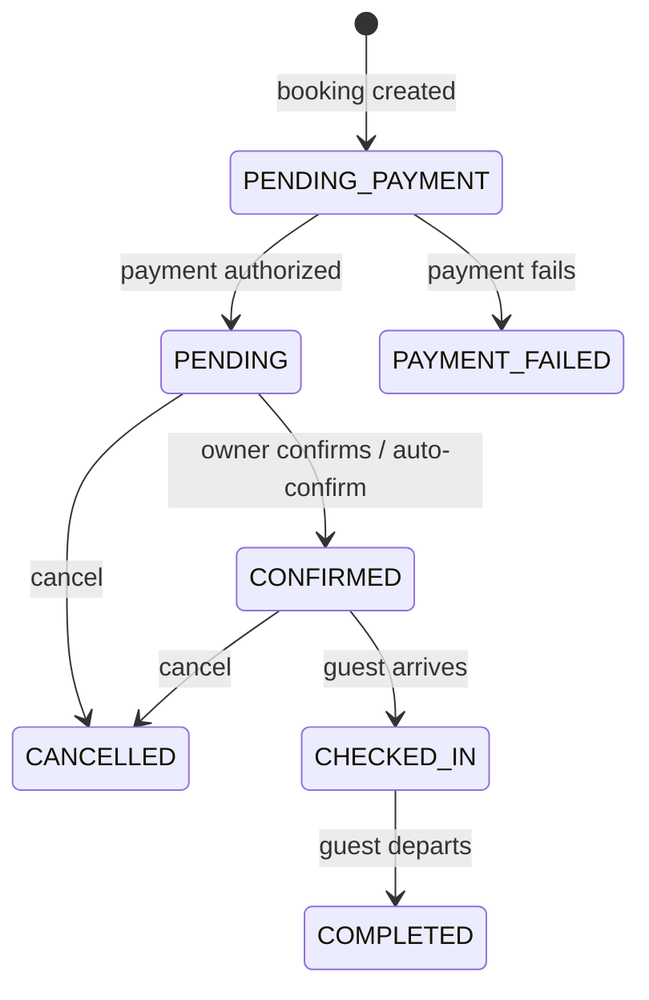
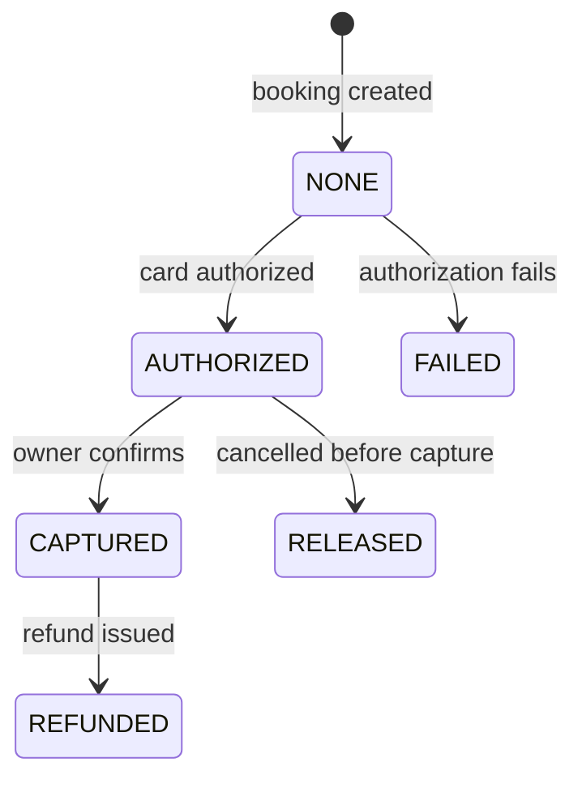
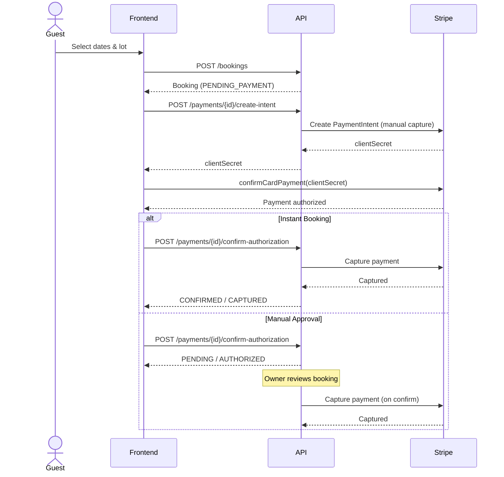

# Payment Flow

## Booking Status Lifecycle

| Status | Description |
|--------|-------------|
| `PENDING_PAYMENT` | Booking created, awaiting guest payment |
| `PENDING` | Payment authorized, awaiting owner confirmation |
| `CONFIRMED` | Owner confirmed (or auto-confirmed), payment captured |
| `CHECKED_IN` | Guest has checked in |
| `COMPLETED` | Stay completed, guest checked out |
| `CANCELLED` | Booking cancelled (authorization released if applicable) |
| `PAYMENT_FAILED` | Payment authorization failed |

## Payment Status Lifecycle

| Status | Description |
|--------|-------------|
| `NONE` | No payment initiated |
| `AUTHORIZED` | Card authorized, hold placed (not yet charged) |
| `CAPTURED` | Payment captured (funds charged) |
| `RELEASED` | Authorization released without charge (cancelled before capture) |
| `REFUNDED` | Payment refunded after capture |
| `FAILED` | Payment authorization failed |

## Confirmation Paths

### Instant Booking (auto-confirm)

When a campsite has `instantBooking=true` (Nore Valley default):

1. Guest creates booking → status: `PENDING_PAYMENT`
2. Guest pays with card → Stripe authorizes → status: `PENDING` / payment: `AUTHORIZED`
3. Backend auto-confirms → Stripe captures → status: `CONFIRMED` / payment: `CAPTURED`

The guest sees the booking as confirmed immediately after payment.

### Manual Approval

When `instantBooking=false`:

1. Guest creates booking → status: `PENDING_PAYMENT`
2. Guest pays with card → Stripe authorizes → status: `PENDING` / payment: `AUTHORIZED`
3. Owner reviews and clicks **Confirm** → Stripe captures → status: `CONFIRMED` / payment: `CAPTURED`
4. Or owner clicks **Reject** → Stripe releases authorization → status: `CANCELLED` / payment: `RELEASED`

## Stripe Integration

### Booking Creation Sequence

### Manual Capture Mode

All booking payments use Stripe's **manual capture** flow:

1. `PaymentIntent` created with `capture_method: manual`
2. Guest's card is **authorized** (hold placed, no charge)
3. Payment is **captured** only when the booking is confirmed
4. If cancelled before capture, the authorization is **released**

This protects guests from being charged for unconfirmed bookings.

### Webhook Events Handled

| Stripe Event | Handler | Action |
|-------------|---------|--------|
| `payment_intent.amount_capturable_updated` | `handlePaymentIntentSucceeded` | Updates booking to PENDING/AUTHORIZED (manual capture auth) |
| `payment_intent.succeeded` | `handlePaymentIntentSucceeded` | Updates booking to PENDING/AUTHORIZED |
| `payment_intent.payment_failed` | `handlePaymentIntentFailed` | Updates booking to PAYMENT_FAILED |
| `charge.captured` | `handleChargeCaptured` | Confirms payment capture for booking |
| `charge.refunded` | `handleChargeRefunded` | Records refund amount |
| `transfer.created` | `handleTransferCreated` | Records owner payout via Connect |

### Dual-Update Mechanism

After Stripe confirms card authorization on the frontend:

1. **Primary:** Frontend calls `POST /api/payments/{bookingId}/confirm-authorization` to immediately sync the booking status
2. **Fallback:** Stripe webhook (`payment_intent.amount_capturable_updated`) arrives and updates the booking status

If the `confirmAuthorization` call fails, the frontend waits 1.5s for the webhook to arrive before navigating to the trips page.

## Testing with Stripe Sandbox

### Test Card Numbers

| Card Number | Scenario |
|------------|----------|
| `4242 4242 4242 4242` | Successful payment |
| `4000 0025 0000 3155` | Requires 3D Secure authentication |
| `4000 0000 0000 9995` | Payment declined |

Use any future expiry date and any 3-digit CVC.

### How to Test

1. Start all services: `./start.sh` (fresh DB)
2. Log in as guest: `family@example.com` / `password`
3. Browse to a campsite (e.g., Nore Valley) and select dates
4. Book a lot and pay with test card `4242 4242 4242 4242`
5. Booking should auto-confirm (Nore Valley has instant booking enabled)
6. Verify in [Stripe Dashboard](https://dashboard.stripe.com/test/payments) - payment should appear as captured

### Testing Manual Confirmation

1. As owner (`norevalley@myisland.com`), toggle instant booking OFF in preferences
2. As guest, create a new booking and pay
3. As owner, go to Bookings page - new booking shows as **Pending**
4. Click **Confirm** - booking moves to **Confirmed**, Stripe captures the payment
5. Or click **Reject** - booking is cancelled, authorization is released

### Dev Mode vs Sandbox Mode

| Setting | `STRIPE_DEV_MODE=true` | `STRIPE_DEV_MODE=false` |
|---------|----------------------|------------------------|
| Payment form | Shows "Development Mode" banner, no real card input | Shows real Stripe card element |
| Stripe API calls | Simulated locally, no Stripe interaction | Real calls to Stripe test/sandbox API |
| Webhook events | Not received | Received from Stripe (requires webhook endpoint) |
| Dashboard visibility | No payments appear | Payments visible in Stripe test dashboard |

**Note:** Seed data bookings (V1043) are created as `CONFIRMED`/`CAPTURED` with no `stripe_payment_intent_id` to avoid requiring Stripe interaction for seeded data.
