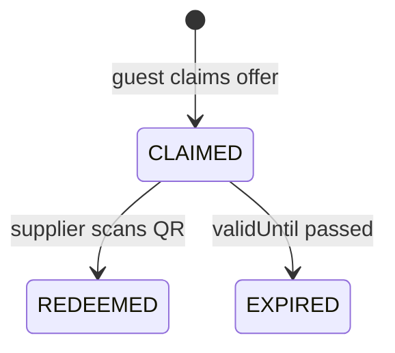
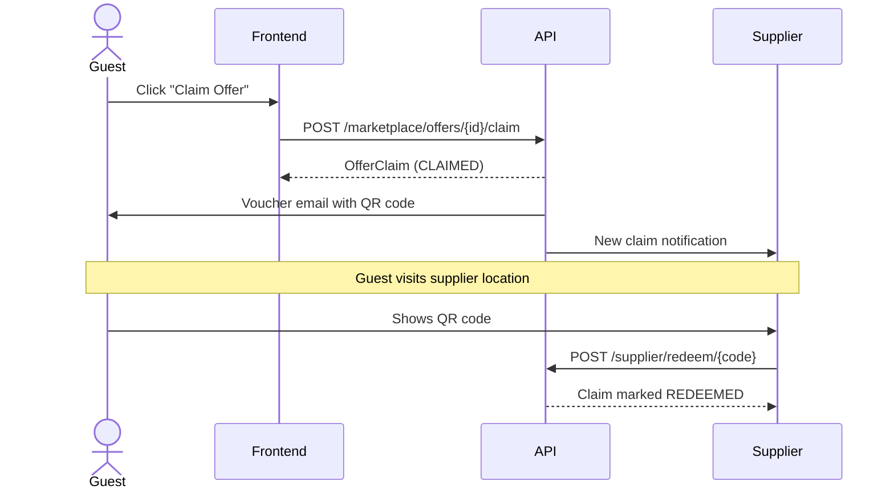

# Marketplace

## Status
Implemented

## Overview
Enables local suppliers (restaurants, activity providers, gear rental, etc.) to create business profiles and publish promotional offers. Guests can browse, claim offers, and redeem them via QR codes at the supplier's location.

## Key Entities

- **Supplier** — Business profile linked to a User. Includes business name, description, logo, category, location (with lat/lng coordinates), contact info, and subscription status.
- **Offer** — A promotional deal published by a supplier. Has title, description, category, discount percentage, validity dates, claim limits, and images.
- **OfferClaim** — Tracks a guest's claim of an offer. Contains claim status, timestamps, and the claim ID used as the voucher/QR code.

## Offer Claim Lifecycle

| Status | Description |
|--------|-------------|
| `CLAIMED` | Guest claimed the offer, voucher ready to use |
| `REDEEMED` | Supplier scanned QR code and marked as used |
| `EXPIRED` | Claim expired (past offer's validUntil date) |

## Offer Categories
`FOOD` | `ACTIVITIES` | `GEAR` | `ATTRACTIONS` | `TRANSPORT`

## Offer Claim & Redeem Flow

## API Endpoints

| Method | Path | Description |
|--------|------|-------------|
| GET | `/api/marketplace/offers` | Browse active offers (public) |
| GET | `/api/marketplace/offers/{id}` | Get offer details (public) |
| GET | `/api/marketplace/suppliers` | Browse suppliers (public) |
| GET | `/api/marketplace/suppliers/{id}` | Get supplier details (public) |
| POST | `/api/marketplace/offers/{id}/claim` | Claim an offer (guest) |
| GET | `/api/supplier/profile` | Get supplier profile |
| PUT | `/api/supplier/profile` | Update supplier profile |
| GET | `/api/supplier/offers` | List supplier's offers |
| POST | `/api/supplier/offers` | Create offer |
| PUT | `/api/supplier/offers/{id}` | Update offer |
| DELETE | `/api/supplier/offers/{id}` | Delete offer |
| POST | `/api/supplier/redeem/{code}` | Redeem voucher via QR code |
| GET | `/api/supplier/claims` | Get supplier's claims |
| GET | `/api/supplier/preferences` | Get supplier notification preferences |
| PUT | `/api/supplier/preferences` | Update supplier notification preferences |
| POST | `/api/supplier/deactivate` | Deactivate supplier account (hides offers) |
| POST | `/api/supplier/reactivate` | Reactivate supplier account |
| GET | `/api/supplier/deactivated` | Check if supplier is deactivated |

## Frontend Pages

- **OffersPage** — Browse marketplace offers (public)
- **SupplierDetailsPage** — Supplier profile with offers and reviews
- **VouchersPage** — Guest's claimed vouchers with QR codes
- **SupplierDashboardPage** — Supplier analytics
- **SupplierProfilePage** — Edit business profile
- **SupplierOffersPage** — Create/manage offers
- **SupplierOfferDetailPage** — View offer with claims
- **SupplierRedeemPage** — QR code scanner for redemption
- **SupplierSettingsPage** — Notification preferences, billing, featured promotion, account deactivation

## Implementation Notes
- Supplier subscription is required to publish offers (managed via `SubscriptionService` + Stripe).
- Featured supplier listings are time-limited promotions (7/30 days) purchased via Stripe.
- Stripe Connect Express is used for supplier payouts (`StripeConnectService`).
- QR codes contain the OfferClaim UUID — scanned by the supplier to trigger redemption.
- Supplier notification preferences (email, claim alerts, weekly report, marketing) stored on Supplier entity.
- Supplier account deactivation is a soft toggle (`isDeactivated`) — deactivating hides all offers; reactivating restores the account but offers remain inactive.
