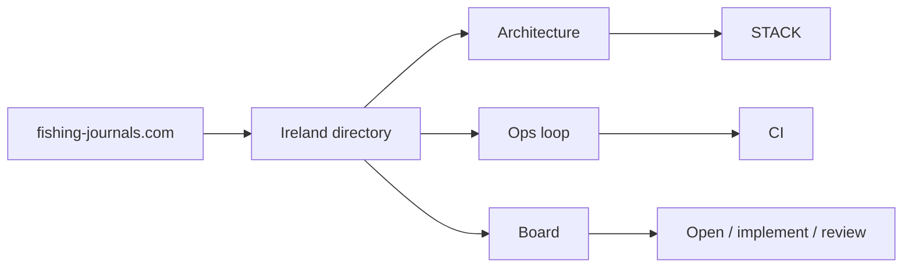

# The map

[[HOME]] · [[home-signal]] · [[home-desk]] · [[home-plugins]]

One directory. One host. Three ways onward.

Ireland listings, free to browse, on [fishing-journals.com](https://fishing-journals.com/). House: Java / Spring Boot, Vite + React PWA, PostgreSQL 17 + PostGIS, Flyway, Grafana OSS, Jenkins and GitHub Actions. [[product/STACK]]

The directory is live. VisitIntent is done ([[ops/tickets/PRD-015]]). In hand: [[ops/tickets/PRD-014]], [[ops/tickets/WF-041]], [[ops/tickets/WF-042]], [[ops/tickets/WF-038]]. In review, start with [[ops/tickets/PRD-010]] and [[ops/tickets/PRD-030]]. Next plans: [[ops/tickets/PRD-009]] · [[ops/tickets/PRD-031]].

## Paths

> [!knowledge] Architecture
> [[product/STACK]] · [[atlas/engineering]] · [[ops/dashboards/architecture]] · [[ops/company/DECISIONS]]

> [!work] Work
> [[ops/workflow/LOOP]] · [[ops/workflow/CI]] · [[ops/BOARD]]

> [!product] Product
> [[product/README]] · [[product/SIGNED]] · [[ops/MILESTONES]]

> [!tip] Plugins
> [[home-plugins]] — one list for all three homes.

Sitemap for the whole vault: [[ATLAS]].

## Tickets

Bases, same filters as the other homes. Open a section when you want the rows. Counts live on [[home-desk]].

> [!example]- Open
> `id` set, not an epic, `status` not `done` and not `inbox`.
>
> ![[ops/dashboards/company-home.base#Open]]

> [!todo]- Implement
> `status` is `implement`.
>
> ![[ops/dashboards/company-home.base#Implement]]

> [!info]- Review
> `status` is `review`.
>
> ![[ops/dashboards/company-home.base#Review]]
