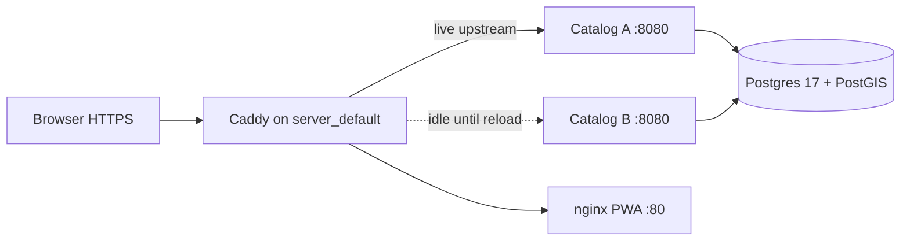
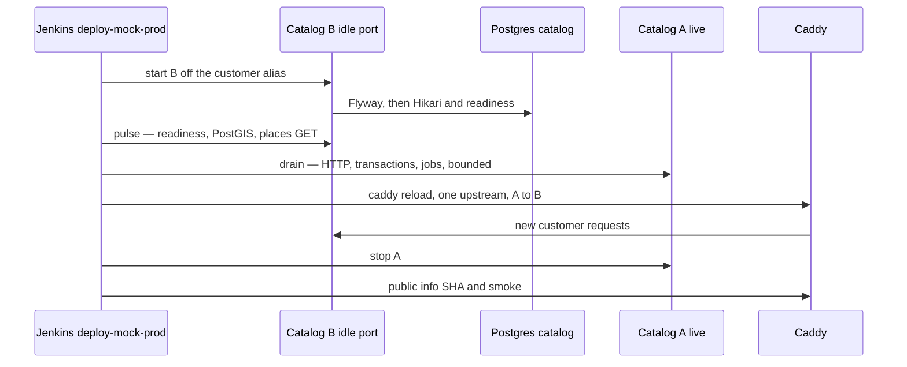

# A-B deploy

Research for the CTO. One host, https://fishing-journals.com, decision 39 in [[ops/company/DECISIONS]]. This note does not lock a decision and does not change [[ops/company/DECISIONS]].

Canon: [[product/STACK]]. Live path: [[ops/runbooks/MOCK_PROD_DEPLOY]], [[ops/tickets/WF-040]]. Today: [[ops/company/ab-deploy/Current cutover]].

> [!important] One machine
> Java/Spring Boot catalog, Vite React PWA, PostgreSQL 17 + PostGIS, Flyway, Jenkins `deploy-mock-prod` on a timer. Customers can be in the app. There is one database on that VPS. No second fleet, no GitHub Environment named `production`, no `compose.prod`, no prod SSH path.

## Current pain

Jenkins on the Mac mini (decision 37) runs `deploy-mock-prod` every few minutes. When `origin/main` is green and the public SHA differs, `scripts/deploy-mock-prod.sh` rsyncs the tree, builds images on the VPS, then `docker compose up -d --force-recreate catalog web`. Caddy is already proxying `island-catalog:8080` and `island-web:80` (`ops/deploy/caddy_apex.py`). Recreate removes those containers before the new JVM is listening. That gap is the customer outage: the apex 502s until the new alias exists. Health, `/actuator/info`, and `ops/scripts/smoke_mock_prod.py` run after the gap. They prove the new process. They do not keep the old one up.

Postgres stays up on the steady path. The exception is the legacy Flyway V7 volume wipe in the same script, which deletes `my-island_ops_pg`.

Pulse, drain, and the reload are one sequence. [[ops/company/ab-deploy/Startup pulse]] is the check. [[ops/company/ab-deploy/Drain]] is the wait. The switch is a Caddy reload the job already knows how to run.

## Comparison

| Option | Downtime | What it can see in-flight | Schema risk | Fits one VPS | Unattended Jenkins |
|---|---|---|---|---|---|
| [[ops/company/ab-deploy/A and B ports\|A and B ports]] | New requests move on `caddy reload` once B has passed the pulse. In-flight HTTP on A finishes only for the drain window. | Caddy sees proxied HTTP. `pg_stat_activity` sees SQL. Actuator does not list either. | One `catalog` database. B runs Flyway while A still serves. [[ops/company/ab-deploy/Expand contract\|Expand/contract]] required. | Yes. Two JREs, one Postgres, same Caddy. | Yes. Same timer, same gate, idle-port pulse so public SHA stays single. |
| [[ops/company/ab-deploy/Blue green compose\|Blue-green compose]] | Same gapless flip if the live alias is never removed. A second project that `down`s the first recreates today's outage. | Same as A/B ports. Compose `--wait` is only the pulse. | Same shared volume `my-island_ops_pg`. The V7 wipe path deletes it. | Yes, with alias, port, and network collisions to design around. | Yes, if the job never `compose down`s the live project. |
| [[ops/company/ab-deploy/Startup pulse\|Startup pulse]] | None by itself. It refuses to hand customers to a process that cannot see the database. | Readiness (`db` + `postgis`) and one `GET /api/v1/places`. Not customer requests. | Proves the migration committed. Does not prove the old JVM tolerates the new columns. | Yes. Loopback or `docker exec` curl, which the image already has. | Yes. The script already waits on health, today after the recreate. |
| [[ops/company/ab-deploy/Drain\|Drain]] | Adds a bounded wait on A. The recreate-first script has no drain. | Honest limits: proxy HTTP, Postgres sessions, no job registry. | None by itself. | Yes. | Yes, inside the 90 minute job, with a cap so `H/5` does not pile up (`disableConcurrentBuilds`). |
| [[ops/company/ab-deploy/Port redirect\|Port redirect]] | A packet redirect is instant on the port it actually owns. | Host conntrack sees that port. Customers are on Caddy :443, not catalog :18081. | Same single database. | The tools exist on the box. Docker already owns nftables for published ports. | Awkward. The job would fight Docker's rules on every deploy. |
| [[ops/company/ab-deploy/Second host\|Second host]] | A later split could move traffic with a balancer. This lock has neither. | A balancer would see HTTP. The one database still would not. | A second Postgres is a different product. One writer keeps today's Flyway story and adds a network hop. | Fights decision 39. | Needs a second SSH target in Jenkins. Still no GitHub `production` Environment. |

## Recommendation

> [!success] Recommendation — not a locked decision
> When an implement ticket is opened, prefer **A and B catalog processes (and a matching web pair) behind the existing Caddy**. Start B off the customer alias. Run the **startup pulse** against B's own port. **Drain** A within a cap. Flip with one `caddy reload` so `/api/*`, `/api/auth*`, `/actuator/health`, `/actuator/info`, and the PWA change together. Then stop A. Keep Postgres where it is. Keep the Jenkins timer, the four-job gate, and public smoke.
>
> Blue-green compose is the same shape with a second project name, and `name: my-island` plus the `island-catalog` alias collide. nftables redirects host :18081, which is the deploy health port, not the apex. A second VPS waits until decision 39's "later split" is a real decision.

> [!warning] One public SHA
> `ops/scripts/gate_mock_prod_deploy.py` reads `https://fishing-journals.com/actuator/info` and skips when `app.gitCommit` already equals `origin/main`. Public info has to stay on A until the reload. Pointing Caddy at both slots, or giving both the alias `island-catalog`, makes that field flap and the timer skip or redeploy blindly.

## Expand/contract

> [!important] Constraint, not a deploy product
> Every option that stays on this VPS shares one Postgres and one `catalog` database. Flyway is on (`spring.flyway.enabled: true`) and runs inside whichever JVM starts, before it can pass readiness. Two processes overlap only when the migration is expand and the old process still runs. Contract migrations, and the script's V7 `docker volume rm`, are outages. Detail: [[ops/company/ab-deploy/Expand contract]].

## Options

| Note | What it is on this host |
|---|---|
| [[ops/company/ab-deploy/Current cutover]] | What `deploy-mock-prod` does today, including the recreate gap |
| [[ops/company/ab-deploy/A and B ports]] | Two JVMs, two idle/live ports, Caddy reload is the switch |
| [[ops/company/ab-deploy/Blue green compose]] | Two Compose projects, one volume, same Caddy |
| [[ops/company/ab-deploy/Startup pulse]] | The gate the other options call before any flip |
| [[ops/company/ab-deploy/Drain]] | What Caddy, Spring, and actuator can and cannot see |
| [[ops/company/ab-deploy/Port redirect]] | nftables on a host whose customers already hit Caddy |
| [[ops/company/ab-deploy/Second host]] | Why a second VPS or an external balancer fights the lock |
| [[ops/company/ab-deploy/Expand contract]] | Shared-database rule every option inherits |

## Out of scope for this packet

Deploy scripts, Jenkins JCasC, compose, and the catalog stay as they are. No new decision row. No production Environment, `compose.prod`, or prod SSH path.
