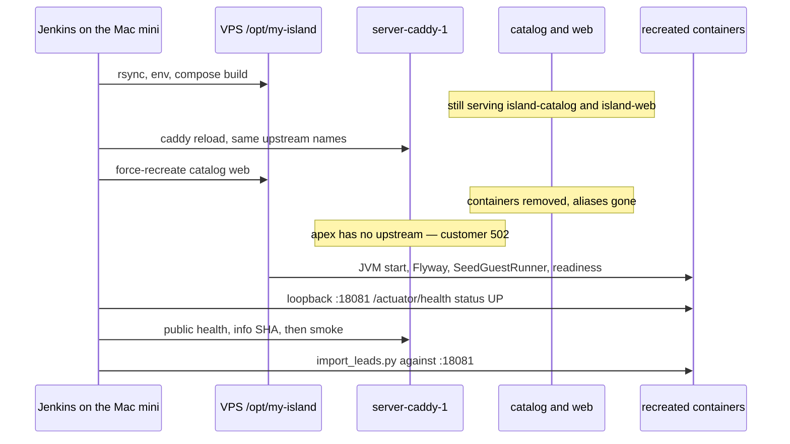

# Current cutover

What ships today. Index: [[ops/company/ab-deploy/AB deploy]]. Host lock: [[ops/company/DECISIONS]] decision 39. Runbook: [[ops/runbooks/MOCK_PROD_DEPLOY]].

## Who runs it

Jenkins job `deploy-mock-prod` (`ops/jenkins/casc/jobs/deploy-mock-prod.groovy`):

- Timer `H/5 * * * *`. No human click (decision 16 and 20).
- `disableConcurrentBuilds()`, timeout 90 minutes.
- Stage `gate-main-gha` runs `ops/scripts/gate_mock_prod_deploy.py`. It prints `DEPLOY <sha>` only when `origin/main` has green GHA `unit tests`, `catalog tests`, `web tests`, and `compose stack` (or the merged PR head that produced a squash SHA), and public `app.gitCommit` is different. Otherwise `SKIP`. Feature branches never deploy. Missing `MOCK_PROD_*` or an unreadable key fails closed.
- Stage `ff-main` checks out a clean clone of `origin/main` (the Mac mini working tree is often dirty). The deploy script then refuses to run unless that clone's `HEAD` equals `origin/main`.
- Stage `deploy` runs `scripts/deploy-mock-prod.sh` with the SSH key from Jenkins. Agents never SSH.
- Stage `http-api-smoke` runs `ops/scripts/smoke_mock_prod.py` against `https://fishing-journals.com`.

The key stays on the Mac mini (decision 37). The VPS is the same machine decision 14 called mock-prod.

## What the script does on the VPS

`MOCK_PROD_REMOTE_DIR` defaults to `/opt/my-island`. Public origin defaults to `https://fishing-journals.com`. Catalog host port defaults to **18081**.

1. Rsync the repo (`--delete`, excluding `.git`, `.env`, `node_modules`, `web/dist`, `services/catalog/target`). Running containers use images, not this tree, so the rsync itself does not swap the jar.
2. Upload `.env.mock-prod` with `GIT_COMMIT`, `GIT_COMMIT_SHORT`, `GIT_BRANCH`, `APP_VERSION`, `APP_BUILD_TIME`, and Google client names. Empty Google values are filled from the old fishing-journals env file on the box.
3. `ops/deploy/caddy_apex.py` rewrites the host Caddyfile (`/home/ubuntu/app/server/Caddyfile` by default), then `docker exec server-caddy-1 caddy reload`. Apex and `app.` send `/api/v1*`, `/api/auth*`, `/actuator/health`, and `/actuator/info` to **`island-catalog:8080`**. Everything else goes to **`island-web:80`**. Reload of an unchanged file is a Caddy reload, not an app swap.
4. If `server-alertmanager-1` / `server-prometheus-1` exist, mute leftover fishing-journals alerts and restart those two containers. That is the old observe stack, not the catalog.
5. **Legacy landmine.** If `flyway_schema_history` version `7` has description matching `user`, the script runs `compose down` and `docker volume rm my-island_ops_pg`. That deletes the data directory. Steady-state V7 on `main` is `V7__place_image.sql` (nullable image columns). The wipe exists for an old V7 that created users. A zero-downtime change has to leave this branch unreachable.
6. `docker compose -f compose.yml -f compose.mock-prod.yml --env-file .env.mock-prod build`, then `up -d --wait --wait-timeout 900 --force-recreate catalog web`.

Compose project name is pinned: `name: my-island` in `compose.mock-prod.yml`. Postgres publishes no host port on this overlay (`ports: !override []`). Catalog publishes `18081:8080` and joins external network `server_default` as alias `island-catalog`. Web is the nginx image (not the Vite dev server), alias `island-web`, no host port. Grafana, Prometheus, Loki, Alertmanager, and Jenkins in this compose file are profile `local-jenkins-only`, so this VPS project does not start them.

## The outage

`--force-recreate catalog web` replaces the only processes Caddy knows. Docker DNS drops `island-catalog` and `island-web` until the new containers attach. Caddy's site blocks have no `health_uri`. They proxy as soon as the name resolves and the port accepts TCP.

The script's first catalog probe is after that recreate: SSH to the VPS and curl `http://127.0.0.1:18081/actuator/health` until JSON `"status":"UP"`, up to `MOCK_PROD_HEALTH_WAIT_SECS` (default 600). Compose `--wait` also blocks the script on the container healthcheck, which is `/actuator/health/readiness`. Customers are on the apex the whole time. The wait is how long the job will stare at a down site before it fails, not a drain of the old process.

Then, from the Jenkins host, public `/actuator/health` must be UP (120s) and `ops/scripts/check_deploy_info.py` must see `app.gitCommit`, `app.version`, and `app.env=mock-prod`. Smoke repeats health, the SHA check, and `GET /api/v1/places?published=true`.

After the public site is already on the new build, the script runs `ops/scripts/import_leads.py` against loopback `:18081`. Customers can be reading places while that import writes.

Postgres is not in the `--force-recreate` list, so the steady path leaves `my-island-postgres-1` up. Sessions in `spring_session` (Flyway V8) survive a JVM replace when the request itself was not cut.

## What the new process does before it is "up"

Catalog is Spring Boot 3.5, Temurin 21, `java -jar` (`services/catalog/Dockerfile`). `services/catalog/src/main/resources/application.yml`:

- Port 8080. No `server.shutdown`. Boot's default is immediate shutdown, so `docker stop` during recreate drops in-flight HTTP. Docker's stop grace then SIGKILL is the only pause.
- Datasource `jdbc:postgresql://postgres:5432/catalog`, user `ops`. No Hikari block, so Boot's default pool (maximum 10) applies. Nothing sets a warmup query or `ApplicationName`.
- `spring.flyway.enabled: true`. Migrations `V1`–`V10` under `db/migration`, including `CREATE EXTENSION postgis` and `spring_session`. Flyway finishes during startup, before the process can pass readiness.
- `SeedGuestRunner` upserts the password Guest when `CATALOG_SEED_GUEST_USERNAME` / `PASSWORD` are set (the overlay sets `guest` / `guest`). Application runners finish before readiness flips to accepting traffic. Tomcat can accept TCP before that runner returns. Caddy will use it.
- Actuator exposes `health`, `info`, `prometheus`. Probes are on. Health details are always shown. Mail health is off. `services/catalog/src/main/java/island/catalog/health/PostgisHealthIndicator.java` runs `select PostGIS_Version()`. Readiness therefore includes the datasource check and PostGIS. There is no `@Scheduled` and no `@EnableScheduling` anywhere in `services/catalog`.
- `info.app.*` is the deploy stamp (`GIT_COMMIT`, version, env, build time). The gate and the smoke both trust the public copy of that JSON.
- Sessions are JDBC (`spring.session.store-type: jdbc`). The cookie is an id in Postgres, not a sticky JVM.

Web on this overlay is nginx serving the built PWA (`web/nginx.conf` only `try_files`). The browser calls `/api` on the apex; nginx does not proxy the API. `web/vite.config.ts` registers a service worker (`registerType: autoUpdate`) and Workbox `StaleWhileRevalidate` for `/api/v1/places|categories|counties`. Phones can show a cached list after the JVM has already changed.

## What a customer hits during the gap

| Surface | During recreate |
|---|---|
| Directory HTML/JS | `island-web` missing, apex 502 |
| `/api/v1/*`, `/api/auth*` | `island-catalog` missing, apex 502 |
| In-flight request on the old JVM | Dropped. Shutdown is immediate. |
| Signed-in session row | Still in Postgres if the volume was kept |
| Installed PWA API cache | Untouched by the script |
| Postgres | Up, unless the V7 wipe ran |

The next cron skips if public info already shows the new SHA, including when smoke failed after a successful stamp. A failed recreate that never updates public info stays `DEPLOY` and retries.
